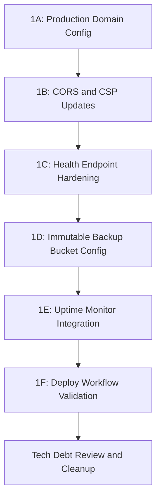

# Phase 1: Launch Blockers — Detailed Implementation Plan

> All items that will cause the app to **break or be unusable** in production.
> Each sub-phase is independently buildable and testable. Build must be green after each.

---

## Sub-phase Overview



---

## Sub-phase 1A: Production Domain Configuration Constants

### Problem

The production domain is referenced in multiple places — CORS config, CSP headers, Firebase Hosting. Currently [`corsConfig.ts`](../functions/src/utils/corsConfig.ts:10) hardcodes `https://www.actionstation.in` and the two Firebase default domains. If the production domain changes, multiple files must be updated manually — violating SSOT.

### What We Build

A single source of truth for production domain configuration, plus structural tests to enforce consistency.

### Architecture Decisions

- **SSOT for domains**: Create `functions/src/utils/domainConfig.ts` — exports `PRODUCTION_DOMAINS` array
- **CORS reads from domainConfig**: [`corsConfig.ts`](../functions/src/utils/corsConfig.ts) imports from `domainConfig.ts` instead of hardcoding
- **Structural test**: Verifies `firebase.json` CSP `connect-src` includes all domains from `domainConfig.ts`
- **No new Zustand stores** — this is pure config, no reactive state
- **No client-side changes** — domain config lives in Cloud Functions only; client CSP is in `firebase.json`

### Files

| File | Action | Purpose |
|------|--------|---------|
| `functions/src/utils/domainConfig.ts` | NEW | SSOT for production domains |
| `functions/src/utils/__tests__/domainConfig.test.ts` | NEW | Unit tests for domain list |
| `functions/src/utils/corsConfig.ts` | EDIT | Import from domainConfig instead of hardcoding |
| `functions/src/utils/__tests__/corsConfig.test.ts` | EDIT | Update to verify domainConfig integration |
| `src/__tests__/domainCorsConsistency.structural.test.ts` | NEW | Structural: firebase.json CSP includes all production domains |

### Implementation

**`domainConfig.ts`** — ~20 lines:

```typescript
/**
 * Production Domain Configuration — SSOT
 * All production-facing domains that need CORS and CSP access.
 * Update this file when adding or changing production domains.
 */

/** Firebase default hosting domains */
export const FIREBASE_DOMAINS = [
    'https://actionstation-244f0.web.app',
    'https://actionstation-244f0.firebaseapp.com',
] as const;

/** Custom production domains */
export const CUSTOM_DOMAINS = [
    'https://www.actionstation.in',
] as const;

/** All production domains — used by CORS config */
export const PRODUCTION_DOMAINS: readonly string[] = [
    ...FIREBASE_DOMAINS,
    ...CUSTOM_DOMAINS,
];
```

**`corsConfig.ts`** — EDIT to import from domainConfig:

```typescript
import { PRODUCTION_DOMAINS } from './domainConfig.js';

const LOCALHOST_ORIGINS = [
    'http://localhost:5173',
    'http://localhost:4173',
];

const envOrigins = process.env.CORS_ALLOWED_ORIGINS?.split(',')
    .map((o) => o.trim()).filter(Boolean) ?? [];

export const ALLOWED_ORIGINS: string[] = [
    ...PRODUCTION_DOMAINS,
    ...LOCALHOST_ORIGINS,
    ...envOrigins,
];
```

### TDD Plan

1. **RED**: `domainConfig.test.ts` — verify `PRODUCTION_DOMAINS` includes all expected domains, no duplicates, all start with `https://`
2. **GREEN**: Create `domainConfig.ts` with the domain arrays
3. **RED**: `domainCorsConsistency.structural.test.ts` — read `firebase.json` CSP `connect-src`, verify every domain in `PRODUCTION_DOMAINS` is present
4. **GREEN**: Verify existing CSP already includes these domains — test should pass without CSP changes
5. **RED**: Update `corsConfig.test.ts` — verify `ALLOWED_ORIGINS` includes all `PRODUCTION_DOMAINS`
6. **GREEN**: Update `corsConfig.ts` to import from `domainConfig.ts`
7. **REFACTOR**: Remove hardcoded domain strings from `corsConfig.ts`

### Acceptance Criteria

- [ ] `PRODUCTION_DOMAINS` is the single source for all production domain strings
- [ ] `corsConfig.ts` has zero hardcoded domain strings — all come from `domainConfig.ts` or env vars
- [ ] Structural test verifies `firebase.json` CSP includes all production domains
- [ ] All existing tests pass — `npm run check` green
- [ ] `functions/` tests pass — `cd functions && npm run check` green

---

## Sub-phase 1B: CSP and Security Headers Validation

### Problem

The CSP in [`firebase.json`](../firebase.json:34) is a single long string. If a required domain is accidentally removed, AI features, auth, or analytics silently break in production. The existing [`cspCompleteness.structural.test.ts`](../src/__tests__/cspCompleteness.structural.test.ts) covers `connect-src` domains but does not validate all security headers.

### What We Build

Extend the existing CSP structural test to also validate that all required HTTP security headers are present in `firebase.json`.

### Files

| File | Action | Purpose |
|------|--------|---------|
| `src/__tests__/cspCompleteness.structural.test.ts` | EDIT | Add tests for all 6 security headers |

### Implementation

Add a new `describe` block to the existing test file:

```typescript
describe('HTTP Security Headers', () => {
    const REQUIRED_HEADERS = [
        { key: 'Strict-Transport-Security', mustContain: 'max-age=' },
        { key: 'X-Frame-Options', mustContain: 'DENY' },
        { key: 'Referrer-Policy', mustContain: 'strict-origin' },
        { key: 'Permissions-Policy', mustContain: 'camera=()' },
        { key: 'X-Content-Type-Options', mustContain: 'nosniff' },
        { key: 'Content-Security-Policy', mustContain: 'default-src' },
    ];

    for (const { key, mustContain } of REQUIRED_HEADERS) {
        it(`has ${key} header with required value`, () => {
            const header = allHeaders.find(h => h.key === key);
            expect(header, `Missing header: ${key}`).toBeDefined();
            expect(header!.value).toContain(mustContain);
        });
    }
});
```

### TDD Plan

1. **RED**: Write tests for all 6 headers — they should all pass since headers already exist in `firebase.json`
2. **GREEN**: Verify tests pass — no code changes needed, this is a safety net
3. **REFACTOR**: Extract `allHeaders` parsing into a shared `beforeAll` if not already done

### Acceptance Criteria

- [ ] Structural test validates all 6 security headers exist in `firebase.json`
- [ ] Test fails if any header is removed — regression protection
- [ ] `npm run check` green

---

## Sub-phase 1C: Health Endpoint Hardening

### Problem

The [`health.ts`](../functions/src/health.ts) endpoint returns a hardcoded `version: '1.0.0'`. In production, this should reflect the actual deployed version for debugging. Also, the health endpoint has no rate limiting — it could be abused for DDoS amplification.

### What We Build

1. Read version from `package.json` at build time
2. Add lightweight rate limiting to the health endpoint
3. Add a structural test ensuring the health endpoint is exported

### Architecture Decisions

- **Version from package.json**: Read at module load time via `require` — Cloud Functions run in Node.js
- **Rate limiting**: Use the existing in-memory rate limiter — 60 req/min per IP is generous for health checks
- **No auth required**: Health endpoints must be public for uptime monitors

### Files

| File | Action | Purpose |
|------|--------|---------|
| `functions/src/health.ts` | EDIT | Dynamic version, rate limiting |
| `functions/src/__tests__/health.test.ts` | NEW | Unit tests for health endpoint |

### Implementation

**`health.ts`** — ~30 lines:

```typescript
import { onRequest } from 'firebase-functions/v2/https';
import { ALLOWED_ORIGINS } from './utils/corsConfig.js';
import { createInMemoryRateLimiter } from './utils/inMemoryRateLimiter.js';
import { readFileSync } from 'fs';
import { join } from 'path';

const limiter = createInMemoryRateLimiter({ maxRequests: 60, windowMs: 60_000 });

function getVersion(): string {
    try {
        const pkg = JSON.parse(readFileSync(join(__dirname, '..', 'package.json'), 'utf-8'));
        return pkg.version ?? '0.0.0';
    } catch {
        return '0.0.0';
    }
}

const APP_VERSION = getVersion();

export const health = onRequest({ cors: ALLOWED_ORIGINS }, (req, res) => {
    const ip = req.headers['x-forwarded-for']?.toString().split(',')[0]?.trim() ?? req.ip ?? 'unknown';
    if (!limiter.check(ip)) {
        res.status(429).json({ error: 'Too many requests' });
        return;
    }
    res.status(200).json({
        status: 'ok',
        version: APP_VERSION,
        timestamp: new Date().toISOString(),
    });
});
```

### TDD Plan

1. **RED**: `health.test.ts` — test returns 200 with `status`, `version`, `timestamp` fields
2. **RED**: Test returns 429 after 60 rapid requests from same IP
3. **GREEN**: Implement the updated health endpoint
4. **REFACTOR**: Ensure version reading is safe — fallback to `'0.0.0'` on error

### Acceptance Criteria

- [ ] Health endpoint returns dynamic version from `package.json`
- [ ] Rate limited to 60 req/min per IP
- [ ] Returns 429 on rate limit exceeded
- [ ] All fields are present: `status`, `version`, `timestamp`
- [ ] `cd functions && npm run check` green

---

## Sub-phase 1D: Immutable Backup Bucket Configuration

### Problem

[`firestoreBackup.ts`](../functions/src/firestoreBackup.ts:39) still points to the old non-immutable bucket `gs://actionstation-244f0-firestore-backups`. Per [Decision 29](../MEMORY.md), the immutable bucket should be used after running the setup script.

### What We Build

1. Make the backup bucket name configurable via environment variable
2. Add a structural test ensuring the backup function uses the correct bucket
3. Add validation that the bucket name follows the expected pattern

### Architecture Decisions

- **Environment variable**: `BACKUP_BUCKET_NAME` — allows switching between old and immutable bucket without code changes
- **Default**: Falls back to the immutable bucket name if env var is not set
- **Structural test**: Verifies the backup function references the bucket config, not a hardcoded string

### Files

| File | Action | Purpose |
|------|--------|---------|
| `functions/src/firestoreBackup.ts` | EDIT | Read bucket from env with immutable default |
| `functions/src/__tests__/firestoreBackup.test.ts` | NEW | Unit tests for backup config |
| `functions/src/__tests__/firestoreBackup.structural.test.ts` | NEW | Structural: no hardcoded bucket names |

### Implementation

**`firestoreBackup.ts`** — change bucket constant:

```typescript
const PROJECT_ID = 'actionstation-244f0';
const DEFAULT_BUCKET = `${PROJECT_ID}-firestore-backups-immutable`;
const BACKUP_BUCKET = `gs://${process.env.BACKUP_BUCKET_NAME ?? DEFAULT_BUCKET}`;
```

### TDD Plan

1. **RED**: Structural test — verify `firestoreBackup.ts` source does not contain the old bucket name as a hardcoded string
2. **GREEN**: Update the bucket constant to use env var with immutable default
3. **RED**: Unit test — verify backup function constructs correct output URI prefix
4. **GREEN**: Ensure the function uses the configurable bucket
5. **REFACTOR**: Update inline documentation comments

### Acceptance Criteria

- [ ] Backup bucket defaults to immutable bucket name
- [ ] Bucket name is configurable via `BACKUP_BUCKET_NAME` env var
- [ ] Structural test prevents regression to old bucket name
- [ ] `cd functions && npm run check` green

---

## Sub-phase 1E: Uptime Monitor Configuration Service

### Problem

No external uptime monitoring is configured. The health endpoint exists but nothing pings it.

### What We Build

This is primarily an **ops task** — no code changes needed. However, we will add documentation and a structural test that verifies the health endpoint is properly exported.

### Files

| File | Action | Purpose |
|------|--------|---------|
| `functions/src/__tests__/healthExport.structural.test.ts` | NEW | Verify health is exported from index.ts |
| `docs/UPTIME-MONITORING.md` | NEW | Setup guide for uptime monitoring |

### Implementation

**Structural test** — verify `functions/src/index.ts` exports `health`:

```typescript
import { readFileSync } from 'fs';
import { join } from 'path';

const INDEX_SRC = readFileSync(join(__dirname, '..', 'index.ts'), 'utf-8');

describe('Health endpoint export', () => {
    it('index.ts exports the health function', () => {
        expect(INDEX_SRC).toContain("export { health }");
    });
});
```

**`docs/UPTIME-MONITORING.md`** — setup guide:
- Recommended services: BetterUptime, Checkly, UptimeRobot
- Health endpoint URL pattern
- Alert configuration — email + Slack
- Expected response format

### TDD Plan

1. **RED**: Structural test for health export — should pass immediately since it is already exported
2. **GREEN**: Verify test passes
3. Write documentation

### Acceptance Criteria

- [ ] Structural test verifies health endpoint is exported
- [ ] Documentation created for uptime monitoring setup
- [ ] `cd functions && npm run check` green

---

## Sub-phase 1F: Deploy Workflow Validation

### Problem

The deploy workflow needs validation that all required secrets are actually configured. Currently, if a secret is missing, the build silently embeds empty strings — causing runtime failures.

### What We Build

A pre-deploy validation step in the CI workflow that checks all required env vars are non-empty before building.

### Files

| File | Action | Purpose |
|------|--------|---------|
| `.github/workflows/deploy.yml` | EDIT | Add env var validation step |
| `src/__tests__/deployWorkflow.structural.test.ts` | NEW | Verify deploy.yml has all required env vars |

### Implementation

**Deploy workflow** — add validation step before build:

```yaml
- name: Validate required secrets
  run: |
    MISSING=""
    for VAR in VITE_FIREBASE_API_KEY VITE_FIREBASE_AUTH_DOMAIN VITE_FIREBASE_PROJECT_ID \
               VITE_FIREBASE_STORAGE_BUCKET VITE_FIREBASE_MESSAGING_SENDER_ID VITE_FIREBASE_APP_ID \
               VITE_CLOUD_FUNCTIONS_URL VITE_GOOGLE_CLIENT_ID VITE_SENTRY_DSN VITE_POSTHOG_KEY; do
      VALUE=$(eval echo "\$$VAR")
      if [ -z "$VALUE" ]; then
        MISSING="$MISSING $VAR"
      fi
    done
    if [ -n "$MISSING" ]; then
      echo "CRITICAL: Missing required secrets:$MISSING"
      exit 1
    fi
    echo "All required secrets present."
  env:
    VITE_FIREBASE_API_KEY: ${{ secrets.VITE_FIREBASE_API_KEY }}
    VITE_FIREBASE_AUTH_DOMAIN: ${{ secrets.VITE_FIREBASE_AUTH_DOMAIN }}
    VITE_FIREBASE_PROJECT_ID: ${{ secrets.VITE_FIREBASE_PROJECT_ID }}
    VITE_FIREBASE_STORAGE_BUCKET: ${{ secrets.VITE_FIREBASE_STORAGE_BUCKET }}
    VITE_FIREBASE_MESSAGING_SENDER_ID: ${{ secrets.VITE_FIREBASE_MESSAGING_SENDER_ID }}
    VITE_FIREBASE_APP_ID: ${{ secrets.VITE_FIREBASE_APP_ID }}
    VITE_CLOUD_FUNCTIONS_URL: ${{ secrets.VITE_CLOUD_FUNCTIONS_URL }}
    VITE_GOOGLE_CLIENT_ID: ${{ secrets.VITE_GOOGLE_CLIENT_ID }}
    VITE_SENTRY_DSN: ${{ secrets.VITE_SENTRY_DSN }}
    VITE_POSTHOG_KEY: ${{ secrets.VITE_POSTHOG_KEY }}
```

**Structural test** — verify deploy.yml references all required vars from `envValidation.ts`:

```typescript
import { readFileSync } from 'fs';
import { join } from 'path';

const DEPLOY_YML = readFileSync(join(process.cwd(), '.github/workflows/deploy.yml'), 'utf-8');

const REQUIRED_VARS = [
    'VITE_FIREBASE_API_KEY', 'VITE_FIREBASE_AUTH_DOMAIN', 'VITE_FIREBASE_PROJECT_ID',
    'VITE_FIREBASE_STORAGE_BUCKET', 'VITE_FIREBASE_MESSAGING_SENDER_ID', 'VITE_FIREBASE_APP_ID',
    'VITE_CLOUD_FUNCTIONS_URL', 'VITE_GOOGLE_CLIENT_ID',
];

describe('deploy.yml env var completeness', () => {
    for (const varName of REQUIRED_VARS) {
        it(`references ${varName} in the Build step`, () => {
            expect(DEPLOY_YML).toContain(varName);
        });
    }
});
```

### TDD Plan

1. **RED**: Structural test — verify deploy.yml contains all required vars — should pass since they are already there
2. **GREEN**: Verify test passes
3. Add validation step to deploy.yml

### Acceptance Criteria

- [ ] Deploy workflow fails fast if any required secret is missing
- [ ] Structural test verifies deploy.yml references all vars from `envValidation.ts`
- [ ] `npm run check` green

---

## Tech Debt Tracking

### Tech Debt Incurred in Phase 1

| Item | Description | Resolution |
|------|-------------|------------|
| None expected | Phase 1 is config/infrastructure — no feature code, no UI components | N/A |

### Pre-existing Tech Debt Addressed in Phase 1

| Item | Description | Resolution |
|------|-------------|------------|
| Hardcoded domains in CORS | [`corsConfig.ts`](../functions/src/utils/corsConfig.ts) has hardcoded domain strings | Moved to `domainConfig.ts` SSOT |
| Hardcoded health version | [`health.ts`](../functions/src/health.ts:12) returns `'1.0.0'` always | Dynamic version from `package.json` |
| No rate limit on health | Health endpoint could be abused for DDoS amplification | Added in-memory rate limiter |
| Old backup bucket name | [`firestoreBackup.ts`](../functions/src/firestoreBackup.ts:39) points to non-immutable bucket | Configurable with immutable default |
| No deploy secret validation | Missing secrets cause silent runtime failures | Pre-build validation step added |
| No security header tests | Only CSP tested, not HSTS/X-Frame-Options/etc. | Extended structural test |

### Tech Debt Verification Checklist

After Phase 1 completion:

- [ ] Zero hardcoded domain strings in `corsConfig.ts`
- [ ] Zero hardcoded version strings in `health.ts`
- [ ] Zero hardcoded bucket names in `firestoreBackup.ts`
- [ ] All 6 security headers have structural test coverage
- [ ] Deploy workflow validates all secrets before build
- [ ] `npm run check` — all tests pass, zero lint warnings
- [ ] `cd functions && npm run check` — all function tests pass
- [ ] No new `any` types introduced
- [ ] No new `console.*` calls — all logging via `logger`
- [ ] All new files under 300 lines
- [ ] All new functions under 50 lines

---

## Build Verification Order

After each sub-phase, run:

```bash
# Frontend
npm run check          # typecheck + lint + test

# Cloud Functions
cd functions && npm run check   # lint + test + build
```

Both must be green before proceeding to the next sub-phase.

---

## Security Compliance Checklist

- [ ] No secrets in source code — all via env vars or Secret Manager
- [ ] CORS origins are explicit — no wildcards
- [ ] CSP is strict — no `unsafe-eval`, no bare `*` in sources
- [ ] Rate limiting on all public endpoints
- [ ] Input validation on all user-facing parameters
- [ ] No `eval()`, `Function()`, or dynamic code execution
- [ ] All new Cloud Function endpoints follow the security layer order: Bot Detection → IP Rate Limit → Auth → User Rate Limit → Body Size → Domain Logic

---

*Phase 1 plan created: 26 March 2026*
*Estimated new files: 6 | Estimated edited files: 5 | Estimated new test files: 5*
