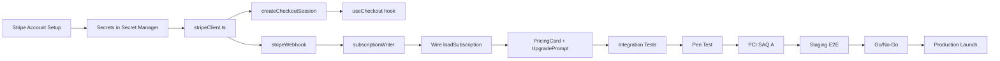
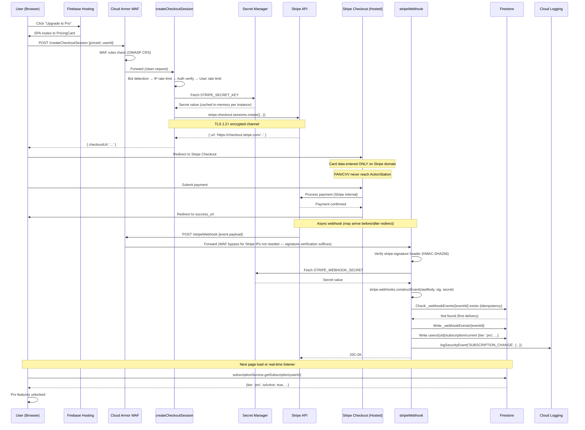
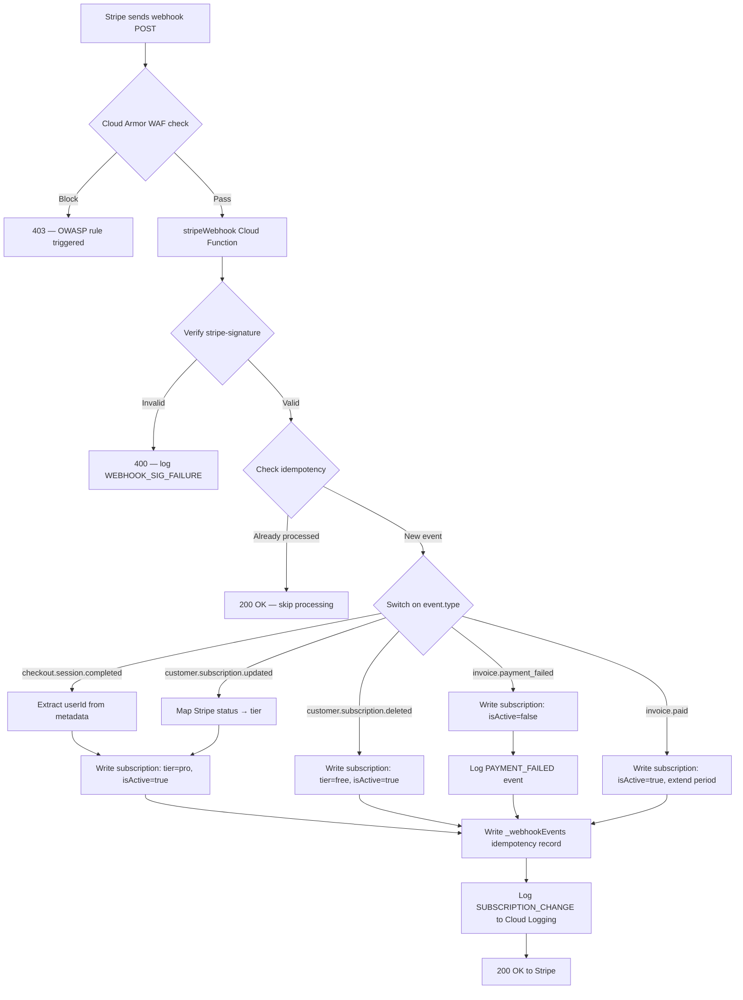
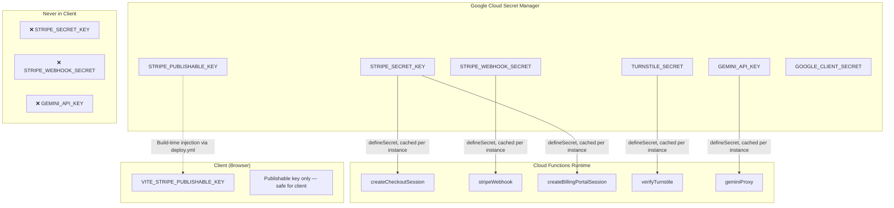

# Phase 2: Payment System Integration and Cybersecurity Compliance

> Comprehensive plan for integrating Stripe payments into ActionStation with 100% PCI DSS compliance,
> zero key/data loss, and production-grade security posture.
> Created: 28 March 2026 | Phase 1 complete — all launch blockers resolved.

---

## Table of Contents

1. [Executive Summary](#1-executive-summary)
2. [Scope, Objectives, and Success Criteria](#2-scope-objectives-and-success-criteria)
3. [Deliverables List](#3-deliverables-list)
4. [Phased Timeline and Milestones (Weeks 1–12)](#4-phased-timeline-and-milestones-weeks-112)
5. [Work Breakdown Structure](#5-work-breakdown-structure)
6. [System and Data Architecture](#6-system-and-data-architecture)
7. [Data Flow Diagrams](#7-data-flow-diagrams)
8. [Security Architecture and Controls](#8-security-architecture-and-controls)
9. [Network Security and Monitoring](#9-network-security-and-monitoring)
10. [Compliance Mapping](#10-compliance-mapping)
11. [Threat Modeling and Risk Assessment](#11-threat-modeling-and-risk-assessment)
12. [Payment System Specifics](#12-payment-system-specifics)
13. [Operational Readiness](#13-operational-readiness)
14. [Documentation and Governance](#14-documentation-and-governance)
15. [Data Protection Specifics](#15-data-protection-specifics)
16. [Tooling Stack](#16-tooling-stack)
17. [Implementation Templates and Pseudocode](#17-implementation-templates-and-pseudocode)
18. [Stakeholder Review and Approval](#18-stakeholder-review-and-approval)
19. [Post-Launch Monitoring and Continuous Improvement](#19-post-launch-monitoring-and-continuous-improvement)

---

## 1. Executive Summary

ActionStation is a BASB (Building a Second Brain) infinite canvas application running on Firebase (Firestore, Cloud Functions, Hosting, Storage) with a React/Vite frontend. Phase 1 resolved all launch blockers — domain config, CORS/CSP SSOT, health endpoint hardening, immutable backups, uptime monitoring, and deploy workflow validation.

Phase 2 integrates **Stripe** as the sole payment gateway for an India + Global hybrid market (INR + international currencies). The architecture achieves **PCI DSS SAQ A** compliance by ensuring card data **never touches ActionStation servers** — all payment data is handled entirely by Stripe Checkout and Stripe's PCI Level 1 certified infrastructure.

### Key Decisions

| Decision | Rationale |
|----------|-----------|
| **Stripe only** (no Razorpay) | Stripe India supports INR, UPI, netbanking, and international cards. Single integration reduces attack surface. |
| **Stripe Checkout** (hosted) | Card data never enters our environment. PCI SAQ A eligible. |
| **PCI DSS SAQ A** | <20K transactions/year, no card data handling. Self-assessment questionnaire only. |
| **SOC 2 / ISO 27001 deferred** | Out of scope for this phase. Foundation controls built now will accelerate future certification. |
| **Phase 3 (limits) / Phase 4 (legal) remain separate** | This plan is payments + security only. Tightly scoped for 12-week delivery. |

---

## 2. Scope, Objectives, and Success Criteria

### 2.1 Scope

**In Scope:**
- Stripe account setup, product/price configuration (Free + Pro tiers, INR + USD)
- Cloud Functions: `createCheckoutSession`, `stripeWebhook`, `createBillingPortalSession`
- Webhook event processing: `checkout.session.completed`, `customer.subscription.updated`, `customer.subscription.deleted`, `invoice.payment_failed`, `invoice.paid`
- Firestore subscription document writes from webhooks
- Subscription state loading on auth (wire `loadSubscription` into auth flow)
- Billing UI: PricingCard, UpgradePrompt, subscription status in AccountSection
- Stripe Customer Portal integration for self-service management
- Secrets management: Stripe keys in Google Cloud Secret Manager
- Key lifecycle: generation, rotation, backup, revocation procedures
- Security hardening: webhook signature verification, idempotency, rate limiting
- Cloud Armor WAF deployment (scripted in Phase 1, executed in Phase 2)
- Turnstile CAPTCHA client-side integration on LoginPage
- PCI DSS SAQ A compliance documentation and evidence
- Threat model (STRIDE) and risk register
- Incident response runbooks for payment events
- Penetration testing plan and execution
- Monitoring dashboards for payment health and security posture

**Out of Scope:**
- Free tier limit enforcement (Phase 3)
- Legal pages — Terms of Service, Privacy Policy (Phase 4)
- Landing page and marketing site (Phase 5)
- SOC 2 / ISO 27001 certification
- Multi-currency dynamic pricing (single price per currency at launch)
- Subscription plan changes (upgrade/downgrade mid-cycle) — defer to Phase 3
- Refund automation — manual via Stripe Dashboard initially
- On-premises infrastructure (fully cloud-native on GCP/Firebase)

### 2.2 Objectives

| # | Objective | Measurable Target |
|---|-----------|-------------------|
| O1 | Functional payment flow | User can subscribe to Pro via Stripe Checkout and see Pro features unlocked within 30 seconds |
| O2 | Webhook reliability | 100% of Stripe webhook events processed with idempotency (zero duplicate state writes) |
| O3 | PCI DSS SAQ A | Completed SAQ A self-assessment with zero non-compliant items |
| O4 | Zero key leakage | No API keys, signing secrets, or tokens in client bundles, logs, or error reports |
| O5 | Key lifecycle management | Documented rotation, backup, and revocation for all 6+ secrets |
| O6 | Security testing | Penetration test report with zero critical/high findings unresolved |
| O7 | Operational readiness | <5min rollback, 99.9% uptime target, automated alerting on payment failures |
| O8 | Audit trail | All subscription state changes logged with actor, timestamp, and event correlation ID |

### 2.3 Success Criteria

| Criterion | Validation Method |
|-----------|-------------------|
| End-to-end checkout works in test and production modes | Manual test + automated E2E |
| Webhook processes all 5 event types correctly | Integration tests with Stripe CLI |
| Subscription state persists and loads on re-login | Manual test across sessions |
| Stripe signing secret verified on every webhook | Unit test + structural test |
| No PAN/CVV/card data in Firestore, logs, or Sentry | Code audit + log review |
| All secrets in Secret Manager, zero in env files or code | Structural test + Gitleaks scan |
| Key rotation procedure tested end-to-end | Tabletop exercise documented |
| WAF deployed and blocking OWASP Top 10 payloads | Cloud Armor log review + test payloads |
| Penetration test passed with zero critical findings | Third-party pentest report |
| `npm run check` green with all new structural tests | CI pipeline |

---

## 3. Deliverables List

### 3.1 Cloud Functions (Server-Side)

| # | Deliverable | Type | Est. Lines | Priority |
|---|-------------|------|-----------|----------|
| D1 | `createCheckoutSession.ts` | New Cloud Function | ~80 | P0 |
| D2 | `stripeWebhook.ts` | New Cloud Function | ~120 | P0 |
| D3 | `createBillingPortalSession.ts` | New Cloud Function | ~50 | P1 |
| D4 | `stripeWebhookHandlers.ts` | New utility (event handlers) | ~150 | P0 |
| D5 | `stripeClient.ts` | New utility (Stripe SDK init) | ~30 | P0 |
| D6 | `subscriptionWriter.ts` | New utility (Firestore writes) | ~80 | P0 |
| D7 | `webhookIdempotency.ts` | New utility (dedup guard) | ~50 | P0 |
| D8 | Stripe webhook structural test | New structural test | ~30 | P0 |
| D9 | Unit tests for all new functions | New test files | ~300 | P0 |

### 3.2 Client-Side (Frontend)

| # | Deliverable | Type | Est. Lines | Priority |
|---|-------------|------|-----------|----------|
| D10 | `PricingCard.tsx` | New component | ~80 | P1 |
| D11 | `UpgradePrompt.tsx` | New component | ~60 | P1 |
| D12 | `useCheckout.ts` | New hook (checkout flow) | ~50 | P1 |
| D13 | `useBillingPortal.ts` | New hook (portal redirect) | ~30 | P1 |
| D14 | AccountSection subscription display | Edit existing | ~20 delta | P1 |
| D15 | Auth flow: wire `loadSubscription` on sign-in | Edit existing | ~5 delta | P0 |
| D16 | Turnstile widget on LoginPage | Edit existing | ~30 delta | P1 |

### 3.3 Security and Compliance

| # | Deliverable | Type | Priority |
|---|-------------|------|----------|
| D17 | PCI DSS SAQ A completed form | Document | P0 |
| D18 | STRIDE threat model | Document | P1 |
| D19 | Risk register with mitigations | Document | P1 |
| D20 | Incident response runbook (payments) | Document | P1 |
| D21 | Key lifecycle management document | Document | P0 |
| D22 | Penetration test (internal + external) | Activity | P1 |
| D23 | Cloud Armor WAF deployment | Ops task | P1 |
| D24 | Monitoring dashboard (payment KPIs) | Ops task | P2 |
| D25 | Key rotation runbook and schedule | Document | P0 |

### 3.4 Infrastructure and Config

| # | Deliverable | Type | Priority |
|---|-------------|------|----------|
| D26 | Stripe secrets in Secret Manager | Ops task | P0 |
| D27 | `deploy.yml` update for Cloud Functions | Edit existing | P0 |
| D28 | Firestore rules update (webhook events collection) | Edit existing | P0 |
| D29 | Structural test: no Stripe keys in client code | New test | P0 |
| D30 | Structural test: webhook signature verification present | New test | P0 |

---

## 4. Phased Timeline and Milestones (Weeks 1–12)

### 4.1 Phase Overview

```
Week 1–2:  Foundation        — Stripe setup, secrets, SDK, Firestore schema
Week 3–4:  Core Integration  — Checkout, webhooks, subscription writer
Week 5–6:  Client UI         — Pricing, upgrade prompts, billing portal
Week 7–8:  Security Harden   — WAF deploy, Turnstile, structural tests, pen test prep
Week 9–10: Testing & Audit   — Integration tests, pen test execution, PCI SAQ A
Week 11:   Staging Validation — Full E2E on staging, tabletop exercises
Week 12:   Production Launch  — Go/no-go, canary rollout, monitoring activation
```

### 4.2 Detailed Week-by-Week Plan

#### Week 1: Stripe Account and Secrets Foundation
| Day | Task | Owner | Deliverable |
|-----|------|-------|-------------|
| 1–2 | Create Stripe account (India entity), enable test mode | Product/Ops | Account ready |
| 2–3 | Configure products: Free (implicit), Pro Monthly, Pro Annual | Product/Ops | Products in Stripe |
| 3–4 | Set up prices: INR ₹499/mo, ₹4999/yr; USD $7/mo, $59/yr | Product/Ops | Prices configured |
| 4–5 | Store secrets in GCP Secret Manager: `STRIPE_SECRET_KEY`, `STRIPE_WEBHOOK_SECRET`, `STRIPE_PUBLISHABLE_KEY` | DevOps | D26 |

#### Week 2: Server SDK and Schema
| Day | Task | Owner | Deliverable |
|-----|------|-------|-------------|
| 1–2 | `npm install stripe` in functions/, create `stripeClient.ts` | Backend | D5 |
| 2–3 | Design Firestore schema: `users/{uid}/subscription/current`, `_webhookEvents/{eventId}` | Backend | Schema doc |
| 3–4 | Create `subscriptionWriter.ts` — typed write to subscription doc | Backend | D6 |
| 4–5 | Create `webhookIdempotency.ts` — dedup via `_webhookEvents` collection | Backend | D7 |

#### Week 3: Checkout Session Flow
| Day | Task | Owner | Deliverable |
|-----|------|-------|-------------|
| 1–3 | Implement `createCheckoutSession.ts` with full security layers | Backend | D1 |
| 3–5 | Unit tests for checkout session creation | Backend | D9 partial |

#### Week 4: Webhook Processing
| Day | Task | Owner | Deliverable |
|-----|------|-------|-------------|
| 1–2 | Implement `stripeWebhook.ts` — signature verify, raw body parsing | Backend | D2 |
| 2–4 | Implement `stripeWebhookHandlers.ts` — 5 event type handlers | Backend | D4 |
| 4–5 | Unit tests for all webhook handlers | Backend | D9 partial |

#### Week 5: Billing Portal and Auth Integration
| Day | Task | Owner | Deliverable |
|-----|------|-------|-------------|
| 1–2 | Implement `createBillingPortalSession.ts` | Backend | D3 |
| 2–3 | Wire `loadSubscription` into `subscribeToAuthState` | Frontend | D15 |
| 3–5 | Integration test: Stripe CLI webhook → Firestore → client read | Backend | D9 partial |

#### Week 6: Client UI Components
| Day | Task | Owner | Deliverable |
|-----|------|-------|-------------|
| 1–2 | Build `PricingCard.tsx` — Free vs Pro comparison | Frontend | D10 |
| 2–3 | Build `UpgradePrompt.tsx` — contextual upgrade CTA | Frontend | D11 |
| 3–4 | Build `useCheckout.ts` and `useBillingPortal.ts` hooks | Frontend | D12, D13 |
| 4–5 | Add subscription status to AccountSection | Frontend | D14 |

#### Week 7: Security Hardening
| Day | Task | Owner | Deliverable |
|-----|------|-------|-------------|
| 1–2 | Deploy Cloud Armor WAF (`scripts/setup-cloud-armor.sh`) | DevOps | D23 |
| 2–3 | Integrate Turnstile widget on LoginPage | Frontend | D16 |
| 3–4 | Add structural tests: no Stripe keys in client, webhook sig present | Backend | D29, D30 |
| 4–5 | Structural test: stripe webhook endpoint in bot detection exclusion list | Backend | D8 |

#### Week 8: Key Lifecycle and Compliance Documentation
| Day | Task | Owner | Deliverable |
|-----|------|-------|-------------|
| 1–2 | Write key lifecycle management document | Security | D21 |
| 2–3 | Write key rotation runbook and schedule | Security | D25 |
| 3–4 | Complete STRIDE threat model | Security | D18 |
| 4–5 | Complete risk register with mitigations | Security | D19 |

#### Week 9: Penetration Testing and PCI Audit
| Day | Task | Owner | Deliverable |
|-----|------|-------|-------------|
| 1–3 | Internal penetration test — OWASP ZAP + manual testing | Security | D22 partial |
| 3–5 | External penetration test — third-party vendor | Security | D22 complete |

#### Week 10: PCI SAQ A and Remediation
| Day | Task | Owner | Deliverable |
|-----|------|-------|-------------|
| 1–2 | Complete PCI DSS SAQ A self-assessment | Security | D17 |
| 2–3 | Remediate any pen test findings (critical/high) | Backend | Fixes |
| 3–5 | Write incident response runbook for payment events | Security | D20 |

#### Week 11: Staging Validation
| Day | Task | Owner | Deliverable |
|-----|------|-------|-------------|
| 1–2 | Full E2E test on staging: checkout → webhook → subscription → UI | All | E2E report |
| 2–3 | Tabletop exercise: key compromise scenario | Security | Exercise report |
| 3–4 | Tabletop exercise: webhook delivery failure scenario | Backend | Exercise report |
| 4–5 | Set up monitoring dashboard (payment KPIs) | DevOps | D24 |

#### Week 12: Production Launch
| Day | Task | Owner | Deliverable |
|-----|------|-------|-------------|
| 1 | Go/no-go review with all stakeholders | All | Sign-off |
| 2 | Switch Stripe to live mode, update secrets | DevOps | Live config |
| 3 | Canary deploy: 10% traffic, monitor for 4 hours | DevOps | Canary report |
| 3–4 | Full rollout: 100% traffic | DevOps | Production live |
| 5 | Post-launch monitoring check, incident readiness verification | All | Launch report |

### 4.3 Critical Path



**Critical path duration: 12 weeks.** No task on the critical path can slip without delaying launch. Parallel tracks (WAF deployment, documentation, Turnstile) are off the critical path.

### 4.4 Milestones

| Milestone | Week | Gate Criteria |
|-----------|------|---------------|
| **M1: Secrets Ready** | 1 | All Stripe secrets in Secret Manager, IAM grants verified |
| **M2: Checkout Works** | 3 | Test checkout session creates successfully, redirects to Stripe |
| **M3: Webhooks Process** | 4 | All 5 event types process correctly, idempotency verified |
| **M4: Full Loop** | 5 | Checkout → webhook → Firestore → client subscription read works |
| **M5: UI Complete** | 6 | All billing UI components built and rendering |
| **M6: Security Hardened** | 7 | WAF deployed, Turnstile live, structural tests green |
| **M7: Pen Test Clean** | 9 | Zero critical/high findings (or all remediated) |
| **M8: PCI SAQ A Complete** | 10 | SAQ A submitted with all evidence |
| **M9: Staging Validated** | 11 | E2E pass, tabletops completed, dashboards live |
| **M10: Production Live** | 12 | Go/no-go passed, canary successful, full rollout |

---

## 5. Work Breakdown Structure

### 5.1 WBS with Effort, Dependencies, and Risk

| WBS # | Task | Owner | Effort (days) | Dependencies | Risk | Priority |
|-------|------|-------|---------------|--------------|------|----------|
| **1.0** | **Foundation** | | **8** | | | |
| 1.1 | Create Stripe account + configure products/prices | Ops | 2 | None | Low | P0 |
| 1.2 | Store Stripe secrets in GCP Secret Manager | DevOps | 1 | 1.1 | Medium — IAM misconfiguration | P0 |
| 1.3 | Grant Cloud Functions SA access to secrets | DevOps | 0.5 | 1.2 | Medium | P0 |
| 1.4 | Install `stripe` SDK in functions/ | Backend | 0.5 | None | Low | P0 |
| 1.5 | Create `stripeClient.ts` with `defineSecret` | Backend | 0.5 | 1.2, 1.4 | Low | P0 |
| 1.6 | Design Firestore schema for subscription + webhook events | Backend | 1 | None | Low | P0 |
| 1.7 | Create `subscriptionWriter.ts` | Backend | 1 | 1.6 | Low | P0 |
| 1.8 | Create `webhookIdempotency.ts` | Backend | 1 | 1.6 | Medium — race conditions | P0 |
| 1.9 | Unit tests for 1.5–1.8 | Backend | 1 | 1.5–1.8 | Low | P0 |
| **2.0** | **Core Payment Flow** | | **8** | | | |
| 2.1 | Implement `createCheckoutSession.ts` | Backend | 2 | 1.5 | Medium — security layers | P0 |
| 2.2 | Unit tests for checkout session | Backend | 1 | 2.1 | Low | P0 |
| 2.3 | Implement `stripeWebhook.ts` (signature verification) | Backend | 1.5 | 1.5 | High — raw body parsing | P0 |
| 2.4 | Implement `stripeWebhookHandlers.ts` (5 event types) | Backend | 2 | 1.7, 1.8, 2.3 | Medium | P0 |
| 2.5 | Unit tests for webhook + handlers | Backend | 1.5 | 2.3, 2.4 | Low | P0 |
| **3.0** | **Billing Portal and Auth** | | **5** | | | |
| 3.1 | Implement `createBillingPortalSession.ts` | Backend | 1 | 1.5 | Low | P1 |
| 3.2 | Wire `loadSubscription` into auth state listener | Frontend | 0.5 | 1.7 | Medium — race condition | P0 |
| 3.3 | Integration test: webhook → Firestore → client | Backend | 2 | 2.4, 3.2 | High — async timing | P0 |
| 3.4 | Export new functions from `index.ts` | Backend | 0.5 | 2.1, 2.3, 3.1 | Low | P0 |
| 3.5 | Update Firestore rules for `_webhookEvents` | Backend | 0.5 | 1.6 | Low | P0 |
| **4.0** | **Client UI** | | **5** | | | |
| 4.1 | Build `PricingCard.tsx` component | Frontend | 1.5 | None | Low | P1 |
| 4.2 | Build `UpgradePrompt.tsx` component | Frontend | 1 | None | Low | P1 |
| 4.3 | Build `useCheckout.ts` hook | Frontend | 1 | 2.1, 3.4 | Low | P1 |
| 4.4 | Build `useBillingPortal.ts` hook | Frontend | 0.5 | 3.1, 3.4 | Low | P1 |
| 4.5 | Add subscription display to AccountSection | Frontend | 1 | 3.2 | Low | P1 |
| **5.0** | **Security Hardening** | | **7** | | | |
| 5.1 | Deploy Cloud Armor WAF | DevOps | 2 | DNS config | High — traffic disruption | P1 |
| 5.2 | Turnstile widget on LoginPage | Frontend | 1 | D27 from Phase 1 | Medium | P1 |
| 5.3 | Structural test: no Stripe keys in client code | Backend | 0.5 | 1.5 | Low | P0 |
| 5.4 | Structural test: webhook sig verification present | Backend | 0.5 | 2.3 | Low | P0 |
| 5.5 | Structural test: Stripe webhook excluded from bot detection | Backend | 0.5 | 2.3 | Low | P0 |
| 5.6 | Update deploy.yml for Cloud Functions deployment | DevOps | 1 | 3.4 | Medium | P0 |
| 5.7 | Gitleaks verification for Stripe secrets | DevOps | 0.5 | 1.5 | Low | P0 |
| 5.8 | SIEM integration: payment security events to Cloud Logging | Backend | 1 | 2.3 | Low | P1 |
| **6.0** | **Compliance and Documentation** | | **8** | | | |
| 6.1 | STRIDE threat model for payment flow | Security | 2 | 2.4 | Low | P1 |
| 6.2 | Risk register with mitigations | Security | 1 | 6.1 | Low | P1 |
| 6.3 | Key lifecycle management document | Security | 1 | 1.2 | Low | P0 |
| 6.4 | Key rotation runbook | Security | 1 | 6.3 | Low | P0 |
| 6.5 | Incident response runbook (payments) | Security | 1 | 2.4 | Low | P1 |
| 6.6 | PCI DSS SAQ A completion | Security | 2 | All above | Medium | P0 |
| **7.0** | **Testing and Validation** | | **8** | | | |
| 7.1 | Internal pen test (OWASP ZAP automated) | Security | 2 | 5.1, 5.2 | Medium | P1 |
| 7.2 | External pen test (third-party) | Security | 3 | 7.1 | High — finding severity | P1 |
| 7.3 | Remediate critical/high findings | Backend | 2 | 7.2 | Variable | P0 |
| 7.4 | Tabletop: key compromise scenario | Security | 0.5 | 6.4 | Low | P1 |
| 7.5 | Tabletop: webhook delivery failure | Backend | 0.5 | 6.5 | Low | P1 |
| **8.0** | **Operational Readiness** | | **5** | | | |
| 8.1 | Monitoring dashboard for payment KPIs | DevOps | 1 | 2.4, 5.8 | Low | P2 |
| 8.2 | Staging E2E validation | All | 2 | All above | Medium | P0 |
| 8.3 | Go/no-go review | All | 0.5 | 8.2 | Low | P0 |
| 8.4 | Canary deploy (10% traffic) | DevOps | 0.5 | 8.3 | High — live traffic | P0 |
| 8.5 | Full production rollout | DevOps | 1 | 8.4 | High | P0 |

**Total effort: ~54 person-days across 12 weeks.**

---

## 6. System and Data Architecture

### 6.1 Architecture Overview

```
┌─────────────────────────────────────────────────────────────────────┐
│                         CLIENT (Browser)                            │
│  React/Vite SPA on Firebase Hosting                                │
│  ┌──────────┐  ┌──────────────┐  ┌─────────────┐  ┌──────────┐   │
│  │LoginPage │  │PricingCard   │  │UpgradePrompt│  │Account   │   │
│  │+Turnstile│  │+useCheckout  │  │             │  │Section   │   │
│  └────┬─────┘  └──────┬───────┘  └─────────────┘  └────┬─────┘   │
│       │               │                                  │         │
│       │          ┌────┴────┐                       ┌────┴────┐    │
│       │          │Checkout │                       │Billing  │    │
│       │          │Session  │                       │Portal   │    │
│       │          │Request  │                       │Request  │    │
│       │          └────┬────┘                       └────┬────┘    │
└───────┼───────────────┼─────────────────────────────────┼─────────┘
        │               │                                  │
   HTTPS/TLS 1.3   HTTPS/TLS 1.3                    HTTPS/TLS 1.3
        │               │                                  │
┌───────┼───────────────┼──────────────────────────────────┼─────────┐
│       ▼               ▼              GCP                 ▼         │
│  ┌─────────┐   ┌──────────────┐                  ┌──────────────┐ │
│  │Cloud    │   │Cloud         │                  │Cloud         │ │
│  │Armor   │   │Armor         │                  │Armor         │ │
│  │WAF     │   │WAF           │                  │WAF           │ │
│  └────┬────┘   └──────┬───────┘                  └──────┬───────┘ │
│       ▼               ▼                                  ▼         │
│  ┌─────────┐   ┌──────────────┐                  ┌──────────────┐ │
│  │verify   │   │createCheckout│                  │createBilling │ │
│  │Turnstile│   │Session       │                  │PortalSession │ │
│  │         │   │              │                  │              │ │
│  └─────────┘   └──────┬───────┘                  └──────┬───────┘ │
│                        │                                  │         │
│                        │ Stripe API                       │         │
│                        ▼                                  ▼         │
│                 ┌──────────────┐                  ┌──────────────┐ │
│                 │ Stripe       │                  │ Stripe       │ │
│                 │ Checkout     │──── webhook ───▶│ stripeWebhook│ │
│                 │ (Hosted)     │                  │ Cloud Func   │ │
│                 └──────────────┘                  └──────┬───────┘ │
│                                                          │         │
│                                                          ▼         │
│                                                   ┌──────────────┐ │
│                                                   │ Firestore    │ │
│                                                   │ users/{uid}/ │ │
│                                                   │ subscription/│ │
│                                                   │ current      │ │
│                                                   └──────────────┘ │
└────────────────────────────────────────────────────────────────────┘
```

### 6.2 Firestore Data Model Additions

```
users/{userId}/
  subscription/
    current                         # ← written by stripeWebhook Cloud Function ONLY
      {
        tier: 'free' | 'pro',
        isActive: boolean,
        expiresAt: number | null,           # Unix timestamp (ms)
        stripeCustomerId: string,           # Stripe cus_xxx
        stripeSubscriptionId: string | null, # Stripe sub_xxx
        stripePriceId: string | null,       # Stripe price_xxx
        currentPeriodEnd: number | null,    # Unix timestamp (ms)
        cancelAtPeriodEnd: boolean,
        currency: 'inr' | 'usd',
        updatedAt: number,                  # serverTimestamp
        lastEventId: string,               # Stripe evt_xxx for audit
      }

_webhookEvents/{stripeEventId}              # ← idempotency guard
  {
    eventId: string,                        # Stripe evt_xxx
    eventType: string,                      # e.g. 'checkout.session.completed'
    processedAt: number,                    # serverTimestamp
    userId: string,                         # resolved from Stripe metadata
    expiresAt: number,                      # TTL: processedAt + 30 days
  }

_rateLimits/{doc}                           # ← existing, no changes
```

### 6.3 Data Classification

| Data Element | Classification | Storage | Encryption | Retention |
|-------------|---------------|---------|-----------|-----------|
| Card number (PAN) | **PCI — Never stored** | Stripe only | N/A | N/A |
| CVV/CVC | **PCI — Never stored** | Stripe only | N/A | N/A |
| Stripe Customer ID | Internal | Firestore | AES-256 at rest (GCP default) | Account lifetime |
| Stripe Subscription ID | Internal | Firestore | AES-256 at rest | Account lifetime |
| Webhook event IDs | Internal | Firestore | AES-256 at rest | 30 days (TTL) |
| Stripe Secret Key | Secret | Secret Manager | AES-256 (envelope) | Until rotated |
| Stripe Webhook Signing Secret | Secret | Secret Manager | AES-256 (envelope) | Until rotated |
| Subscription tier/status | Internal | Firestore | AES-256 at rest | Account lifetime |
| Billing email | PII | Stripe only (not stored locally) | Stripe manages | Per Stripe DPA |

### 6.4 Data Residency

- **Firestore**: `us-central1` (existing project region) — multi-region replication within US
- **Cloud Functions**: `us-central1` (co-located with Firestore for latency)
- **Secret Manager**: `us-central1` with automatic replication to `us-east1` (GCP default for Secret Manager)
- **Stripe**: Data processed in Stripe's PCI Level 1 infrastructure (US + India for INR transactions)
- **Indian data residency (RBI)**: Stripe India stores card data within India for INR transactions per RBI mandate. ActionStation never handles card data, so RBI card storage rules do not apply to our infrastructure.

---

## 7. Data Flow Diagrams

### 7.1 Checkout Flow (End-to-End)



### 7.2 Webhook Event Processing Flow



### 7.3 Key and Token Flow



### 7.4 Tokenization and PCI Data Flow

```
┌─────────────────────────────────────────────────────────────┐
│                    PCI DSS BOUNDARY                         │
│                    (Stripe's Environment)                    │
│                                                             │
│  ┌─────────────┐    ┌──────────────┐    ┌──────────────┐  │
│  │ Stripe      │    │ Stripe       │    │ Stripe       │  │
│  │ Checkout    │───▶│ Tokenization │───▶│ Card Vault   │  │
│  │ (Hosted UI) │    │ Engine       │    │ (PCI Level 1)│  │
│  └─────────────┘    └──────────────┘    └──────────────┘  │
│        ▲                                      │            │
│        │                                      │            │
│   Card data                            Payment token       │
│   entered here                         (tok_xxx)           │
│                                               │            │
└───────────────────────────────────────────────┼────────────┘
                                                │
                                                ▼
┌───────────────────────────────────────────────────────────────┐
│              ActionStation Environment                         │
│              (NO card data ever enters here)                  │
│                                                               │
│  ┌──────────────┐    ┌──────────────┐    ┌──────────────┐   │
│  │ Cloud        │    │ Firestore    │    │ Cloud        │   │
│  │ Functions    │    │              │    │ Logging      │   │
│  │              │    │ Stores only: │    │              │   │
│  │ Receives:    │    │ - tier       │    │ Logs only:   │   │
│  │ - event type │    │ - isActive   │    │ - event type │   │
│  │ - cus_xxx    │    │ - cus_xxx    │    │ - cus_xxx    │   │
│  │ - sub_xxx    │    │ - sub_xxx    │    │ - sub_xxx    │   │
│  │              │    │ - price_xxx  │    │ - timestamps │   │
│  │ NEVER:       │    │              │    │              │   │
│  │ - PAN        │    │ NEVER:       │    │ NEVER:       │   │
│  │ - CVV        │    │ - PAN        │    │ - PAN        │   │
│  │ - card data  │    │ - CVV        │    │ - CVV        │   │
│  └──────────────┘    └──────────────┘    └──────────────┘   │
└───────────────────────────────────────────────────────────────┘
```

**P2PE Considerations:** Point-to-Point Encryption is not applicable — ActionStation is a web SaaS with no physical card terminals. All card input occurs on Stripe Checkout's hosted page, which uses Stripe.js with TLS encryption directly to Stripe's servers.

---

## 8. Security Architecture and Controls

### 8.1 Identity and Access Management

| Control | Implementation | Status |
|---------|---------------|--------|
| **MFA** | Google OAuth (inherits user's Google MFA setting) + Turnstile CAPTCHA challenge | Phase 2 — Turnstile client integration |
| **Least Privilege** | Cloud Functions SA has only `secretmanager.secretAccessor`, `datastore.user`, `storage.objectAdmin` | Existing |
| **RBAC** | Two tiers: `free` and `pro`. Subscription document is write-only from server. Client reads via Firestore rules. | Existing read path; Phase 2 adds write path |
| **Session Management** | Firebase Auth ID tokens (1-hour expiry, auto-refresh). No long-lived session cookies. | Existing |
| **Service Account Isolation** | Each Cloud Function uses the default Firebase SA. No cross-project access. | Existing |

### 8.2 Secrets Management

**Backend: Google Cloud Secret Manager**

| Secret | Purpose | Rotation Schedule | Backup |
|--------|---------|-------------------|--------|
| `STRIPE_SECRET_KEY` | Server-side Stripe API calls | 90 days | Secret Manager versioning (automatic) |
| `STRIPE_WEBHOOK_SECRET` | Webhook signature verification | 90 days | Secret Manager versioning |
| `GEMINI_API_KEY` | Gemini AI proxy | 90 days | Secret Manager versioning |
| `TURNSTILE_SECRET` | Cloudflare Turnstile verification | 180 days | Secret Manager versioning |
| `RECAPTCHA_SECRET` | reCAPTCHA v3 verification | 180 days | Secret Manager versioning |
| `GOOGLE_CLIENT_SECRET` | Calendar OAuth | 365 days (Google-managed) | Secret Manager versioning |

**Why Google Cloud Secret Manager (not HashiCorp Vault):**
- Native integration with Cloud Functions via `defineSecret()`
- Zero additional infrastructure — no Vault server to manage
- Automatic envelope encryption (AES-256 + KMS master key)
- IAM-based access control (same as existing GCP IAM)
- Audit logging via Cloud Audit Logs (every secret access logged)
- Automatic multi-region replication within GCP
- Version history enables instant rollback on bad rotation

**HashiCorp Vault would be appropriate if:** on-premises infrastructure existed, multi-cloud key management was needed, or dynamic secrets (short-lived database credentials) were required. None apply here.

### 8.3 Key Lifecycle Management

#### Generation
- All secrets generated by their respective providers (Stripe Dashboard, Cloudflare Dashboard, Google Cloud Console)
- Stripe keys generated with restricted permissions (read-only where possible)
- No secrets generated manually or stored in plaintext anywhere

#### Storage
- **All secrets stored exclusively in Google Cloud Secret Manager**
- Envelope encryption: secret encrypted with DEK → DEK encrypted with KEK in Cloud KMS
- Access requires both IAM permission AND the KEK in KMS
- No secrets in `.env` files, GitHub Secrets (except `VITE_` prefixed publishable keys), or code

#### Rotation Procedure
```
1. Generate new secret version in provider (Stripe Dashboard / Cloudflare)
2. Add new version to Secret Manager:
   gcloud secrets versions add SECRET_NAME --data-file=- <<< "new_secret_value"
3. Verify new version is accessible:
   gcloud secrets versions access latest --secret=SECRET_NAME
4. Cloud Functions automatically pick up new version on next cold start
5. Force cold start if immediate rotation needed:
   gcloud functions deploy FUNCTION_NAME --no-traffic (then restore)
6. Verify webhook/API calls succeed with new secret (monitor Cloud Logging)
7. Disable old secret version after 24-hour soak:
   gcloud secrets versions disable OLD_VERSION --secret=SECRET_NAME
8. Destroy old version after 30-day retention:
   gcloud secrets versions destroy OLD_VERSION --secret=SECRET_NAME
```

#### Rotation Schedule

| Secret | Rotation Interval | Next Rotation | Responsible |
|--------|-------------------|---------------|-------------|
| `STRIPE_SECRET_KEY` | 90 days | Launch + 90d | DevOps |
| `STRIPE_WEBHOOK_SECRET` | 90 days | Launch + 90d | DevOps |
| `GEMINI_API_KEY` | 90 days | Existing schedule | DevOps |
| `TURNSTILE_SECRET` | 180 days | Launch + 180d | DevOps |
| `RECAPTCHA_SECRET` | 180 days | Launch + 180d | DevOps |
| `GOOGLE_CLIENT_SECRET` | 365 days | Google-managed | DevOps |

#### Backup
- Secret Manager automatically retains all versions until explicitly destroyed
- Cross-region: Secret Manager replicates to multiple GCP regions by default
- Recovery: `gcloud secrets versions access VERSION_NUMBER --secret=SECRET_NAME`
- **No manual backup files** — Secret Manager IS the backup system
- Emergency access: Break-glass procedure via Organization Admin role (documented in runbook)

#### Revocation
```
1. IMMEDIATE: Disable the compromised secret version:
   gcloud secrets versions disable VERSION --secret=SECRET_NAME
2. Generate new secret in provider dashboard
3. Add to Secret Manager as new version
4. Force cold start of affected Cloud Functions
5. Log security incident via logSecurityEvent('KEY_REVOCATION', {...})
6. Notify stakeholders per incident response procedure
7. Destroy compromised version after confirmation:
   gcloud secrets versions destroy VERSION --secret=SECRET_NAME
```

#### Escrow
- Not applicable for SaaS API keys — no physical key escrow needed
- Secret Manager's version history serves as the recovery mechanism
- Organization-level IAM break-glass access provides emergency recovery path

### 8.4 Encryption

| Layer | Standard | Implementation |
|-------|----------|----------------|
| **In Transit** | TLS 1.2+ (1.3 preferred) | Firebase Hosting (Google-managed cert), Cloud Functions (GCP edge), Stripe API (Stripe-managed) |
| **At Rest (Firestore)** | AES-256 | GCP default encryption (Google-managed keys, envelope encryption via Cloud KMS) |
| **At Rest (Secret Manager)** | AES-256 + KMS envelope | Automatic — each secret version encrypted with unique DEK, DEK encrypted with KEK in Cloud KMS |
| **At Rest (GCS Backups)** | AES-256 | GCP default + immutable retention policy (Decision 29) |
| **Client-Server** | TLS 1.3 | HSTS enforced (`max-age=31536000; includeSubDomains; preload`) |
| **Function-to-Stripe** | TLS 1.2+ | Stripe SDK enforces minimum TLS 1.2 |
| **Webhook Payload Integrity** | HMAC-SHA256 | `stripe-signature` header verified with `STRIPE_WEBHOOK_SECRET` |

### 8.5 Access Logging and Audit Trails

| Event | Log Destination | Retention | Alert |
|-------|----------------|-----------|-------|
| Secret access | Cloud Audit Logs (Data Access) | 400 days | Anomalous access pattern |
| Subscription state change | Cloud Logging (structured) | 30 days (default), 400 days (audit sink) | Payment failure spike |
| Webhook signature failure | Cloud Logging + securityLogger | 30 days | Immediate (CRITICAL) |
| Stripe API errors | Cloud Logging | 30 days | 5xx spike |
| Auth failures | Cloud Logging + securityLogger | 30 days | Auth failure spike (existing) |
| Rate limit violations | Cloud Logging + securityLogger | 30 days | 429 spike (existing) |
| WAF blocks | Cloud Armor logs | 400 days | Block rate spike |
| Key rotation events | Cloud Audit Logs | 400 days | N/A (scheduled) |

### 8.6 Tamper Resistance

- **Firestore rules**: `subscription` subcollection is `allow write: if false` for clients (existing `firestore.rules:20-23`). Only Cloud Functions (admin SDK, bypasses rules) can write subscription state.
- **Webhook idempotency**: `_webhookEvents` collection prevents replay attacks. Client has no write access (`allow write: if false`).
- **Immutable backups**: GCS object retention policy prevents deletion of Firestore backups for 30 days (Decision 29).
- **Gitleaks**: CI pipeline blocks commits containing secrets (existing in deploy.yml).
- **Structural tests**: Build-time verification that secrets never appear in client code (new D29, D30).

---

## 9. Network Security and Monitoring

### 9.1 Network Segmentation

```
┌──────────────────────────────────────────────────────┐
│                    PUBLIC INTERNET                     │
│  Users, Stripe webhooks, attackers                    │
└─────────────────────┬────────────────────────────────┘
                      │
                      ▼
┌──────────────────────────────────────────────────────┐
│              EDGE LAYER (Cloud Armor)                 │
│  WAF: OWASP CRS v3.3 (8 rule sets)                  │
│  IP Rate Limit: 100 req/min, 5-min ban               │
│  SSL Termination: Google-managed cert                 │
└─────────────────────┬────────────────────────────────┘
                      │
                      ▼
┌──────────────────────────────────────────────────────┐
│           APPLICATION LAYER (Cloud Functions)         │
│  Bot Detection → IP Rate Limit → Auth → User Limit   │
│  Body Size → Domain Logic → Output Scan              │
│  VPC connector: none (serverless, GCP-internal)      │
└─────────────────────┬────────────────────────────────┘
                      │
                      ▼
┌──────────────────────────────────────────────────────┐
│              DATA LAYER (Firestore + GCS)             │
│  IAM-only access (no public endpoints)               │
│  Firestore Security Rules (defence in depth)         │
│  GCS: uniform bucket-level access + retention lock   │
└──────────────────────────────────────────────────────┘
```

### 9.2 Firewall Rules

| Rule | Direction | Source | Destination | Port | Action |
|------|-----------|--------|-------------|------|--------|
| Cloud Armor default-deny | Inbound | * | LB | 443 | Evaluate WAF rules |
| OWASP CRS SQLi | Inbound | * | LB | 443 | Block on match |
| OWASP CRS XSS | Inbound | * | LB | 443 | Block on match |
| IP rate limit | Inbound | * | LB | 443 | Throttle at 100/min |
| Allow Stripe webhooks | Inbound | Stripe IPs | CF | 443 | Allow (verified by signature) |
| Cloud Functions → Stripe | Outbound | CF | Stripe API | 443 | Allow |
| Cloud Functions → Firestore | Outbound | CF | Firestore | 443 | Allow (GCP internal) |
| Cloud Functions → Secret Manager | Outbound | CF | Secret Manager | 443 | Allow (GCP internal) |

**Note:** Cloud Functions on GCP do not have traditional firewall rules — they are serverless and communicate over GCP's internal network. The "firewall" is implemented via Cloud Armor (edge) + application-layer security checks (bot detection, rate limiting, auth).

### 9.3 Web Application Firewall (WAF)

**Implementation:** Cloud Armor with OWASP CRS v3.3 (from `scripts/setup-cloud-armor.sh`)

| Rule Set | Priority | Action | Coverage |
|----------|----------|--------|----------|
| SQL Injection (sqli-v33-stable) | 1000 | Block | SQL injection attempts |
| XSS (xss-v33-stable) | 1001 | Block | Cross-site scripting |
| Local File Inclusion (lfi-v33-stable) | 1002 | Block | Path traversal |
| Remote File Inclusion (rfi-v33-stable) | 1003 | Block | URL injection |
| Remote Code Execution (rce-v33-stable) | 1004 | Block | Command injection |
| Method Enforcement (methodenforcement-v33-stable) | 1005 | Block | Invalid HTTP methods |
| Scanner Detection (scannerdetection-v33-stable) | 1006 | Block | Automated scanners |
| Protocol Attack (protocolattack-v33-stable) | 1007 | Block | HTTP protocol abuse |
| IP Rate Limit | 900 | Throttle (5-min ban) | DDoS / brute force |

**False Positive Monitoring:** 2-week observation period after deployment. Tune rules by adding exceptions for legitimate webhook payloads from Stripe.

### 9.4 IDS/IPS

**Implementation:** Application-layer detection (existing security stack)

| Component | Function | File |
|-----------|----------|------|
| Bot Detector | Scanner/automation UA detection | `functions/src/utils/botDetector.ts` |
| Prompt Filter | AI injection/exfiltration detection | `functions/src/utils/promptFilter.ts` |
| Threat Monitor | Spike detection (429, 500, auth fail, bot) | `functions/src/utils/threatMonitor.ts` |
| File Upload Validator | Malicious file detection | `functions/src/utils/fileUploadValidator.ts` |

**New for Phase 2:**
- Add `WEBHOOK_SIG_FAILURE` event type to `securityLogger.ts`
- Add `PAYMENT_FAILED` event type to `securityLogger.ts`
- Add `SUBSCRIPTION_CHANGE` event type to `securityLogger.ts`
- Threshold for webhook signature failures: >5/min → CRITICAL alert

### 9.5 Secure Logging and SIEM Integration

**Logging Architecture:**
```
Cloud Functions → stdout/stderr (structured JSON)
    → Cloud Logging (automatic ingestion)
        → Log-based metrics (429 spike, 500 spike, auth fail, bot detect)
            → Cloud Monitoring alerting
                → Email + Slack notification channels
```

**SIEM Integration:**
- Cloud Logging serves as the SIEM for this scale
- Log Router can export to BigQuery for long-term analysis if needed
- Structured JSON format with `labels.eden_security: "true"` enables precise filtering
- All payment events carry `correlationId` (Stripe event ID) for cross-system tracing

**New Log Events for Phase 2:**

| Event Type | Severity | Trigger | Data Logged |
|------------|----------|---------|-------------|
| `SUBSCRIPTION_CHANGE` | INFO | Any subscription write | userId, oldTier, newTier, eventId |
| `PAYMENT_FAILED` | WARNING | invoice.payment_failed webhook | userId, invoiceId, failureReason |
| `WEBHOOK_SIG_FAILURE` | ERROR | Invalid stripe-signature | IP, requestHeaders (redacted), timestamp |
| `CHECKOUT_CREATED` | INFO | createCheckoutSession success | userId, priceId, currency |
| `KEY_ROTATION` | INFO | Secret version change | secretName, newVersion, operator |

### 9.6 Anomaly Detection

| Anomaly | Detection Method | Threshold | Response |
|---------|-----------------|-----------|----------|
| Payment failure spike | Cloud Monitoring metric | >10 failures/hour | Alert → manual review |
| Webhook sig failure spike | threatMonitor.ts | >5/min | CRITICAL log → immediate investigation |
| Checkout session abuse | IP rate limiter | >10 checkouts/min per IP | 429 + 5-min ban |
| Subscription state tampering attempt | Firestore rules | Any client write to subscription/ | Silently denied (rules) |
| Secret access anomaly | Cloud Audit Logs | Access outside deploy/cold-start | Alert → investigation |

### 9.7 Incident Response

See [Section 12.7](#127-payment-incident-response) for payment-specific runbooks.

**General Security Incident Response:**

| Phase | Action | Timeline |
|-------|--------|----------|
| **Detection** | Automated alert fires (Cloud Monitoring / threatMonitor) | 0 min |
| **Triage** | On-call reviews alert, determines severity (P1-P4) | <15 min |
| **Containment** | Disable compromised secret, block source IP, disable function | <30 min |
| **Eradication** | Rotate secrets, patch vulnerability, update WAF rules | <4 hours |
| **Recovery** | Verify systems operational, re-enable services | <8 hours |
| **Lessons Learned** | Post-incident review, update runbooks, file MEMORY.md decision | <48 hours |

### 9.8 Vulnerability Management

| Activity | Cadence | Tool |
|----------|---------|------|
| Dependency vulnerability scan | Every CI run | `npm audit` (existing in deploy.yml) |
| SCA (Software Composition Analysis) | Weekly | `npm audit` + Dependabot (GitHub) |
| DAST (Dynamic Application Security Testing) | Monthly | OWASP ZAP automated scan |
| Container/runtime patching | Continuous | Cloud Functions runtime managed by GCP |
| Secret scanning | Every commit | Gitleaks (existing in CI) |
| WAF rule updates | Quarterly | Cloud Armor OWASP CRS version bump |

### 9.9 Patching Cadence

| Component | Patching Approach | Cadence |
|-----------|-------------------|---------|
| Cloud Functions runtime (Node 22) | GCP-managed, automatic | Continuous |
| `stripe` npm package | Dependabot PR | Within 7 days of release |
| `firebase-admin` / `firebase-functions` | Dependabot PR | Within 14 days |
| Frontend dependencies | Dependabot PR | Within 14 days |
| Cloud Armor WAF rules | Manual version bump | Quarterly |

### 9.10 Secure SDLC

| Phase | Controls |
|-------|----------|
| **Design** | STRIDE threat model, security requirements in WBS |
| **Code** | Structural tests (no secrets in code, webhook sig verification), ESLint security rules |
| **Build** | `npm run check` (typecheck + lint + test), Gitleaks secret scan, `npm audit` |
| **Test** | Unit tests, integration tests, OWASP ZAP DAST, manual pen test |
| **Deploy** | Secret validation step, canary rollout, automated rollback |
| **Operate** | Cloud Monitoring alerts, Cloud Audit Logs, key rotation schedule |

### 9.11 Supply Chain Security

| Control | Implementation |
|---------|---------------|
| **Lock file integrity** | `npm ci` (not `npm install`) in CI — respects `package-lock.json` exactly |
| **Dependency audit** | `npm audit` blocks deploy on critical vulnerabilities (existing) |
| **Minimal dependencies** | `stripe` is the only new production dependency for Phase 2 |
| **Dependabot** | Enabled for automated dependency update PRs |
| **No post-install scripts** | Verify `stripe` package has no install scripts (`npm pack --dry-run`) |
| **Signed commits** | Recommended for production deployments |

### 9.12 Vendor Risk Management

| Vendor | Service | Risk Level | Controls |
|--------|---------|-----------|----------|
| **Stripe** | Payment processing | High | PCI Level 1 certified, SOC 2 Type II, annual review of Stripe's compliance page |
| **Google Cloud (Firebase)** | Hosting, Firestore, Functions, Secret Manager | High | SOC 2/3, ISO 27001, FedRAMP, annual review |
| **Cloudflare** | Turnstile CAPTCHA | Medium | SOC 2, review annually |
| **Sentry** | Error monitoring | Low | SOC 2, data masking enabled (`maskAllText`, `blockAllMedia`) |
| **PostHog** | Analytics | Low | SOC 2, `autocapture: false`, `respect_dnt: true` |

---

## 10. Compliance Mapping

### 10.1 PCI DSS Scope Definition

**Merchant Level:** Level 4 (<20,000 e-commerce transactions/year)

**SAQ Type:** SAQ A — Card-not-present merchants that have fully outsourced all cardholder data functions to PCI DSS compliant third-party service providers.

**Justification for SAQ A:**
1. ✅ All payment processing is entirely outsourced to Stripe (PCI Level 1)
2. ✅ No electronic storage, processing, or transmission of cardholder data on our systems
3. ✅ Card data is entered exclusively on Stripe Checkout's hosted pages
4. ✅ No `stripe.js` elements that could capture card data — using Stripe Checkout redirect mode
5. ✅ No payment page served from our domain — full redirect to `checkout.stripe.com`

**CDE (Cardholder Data Environment):** Does not exist within ActionStation's infrastructure. The CDE is entirely within Stripe's environment.

### 10.2 PCI DSS Requirements Mapping (SAQ A)

| PCI Requirement | SAQ A Relevance | ActionStation Implementation |
|-----------------|-----------------|------------------------------|
| **Req 2: No vendor-supplied defaults** | N/A (no CDE) | All secrets unique, generated by providers |
| **Req 6: Secure systems and software** | Applicable | Secure SDLC, structural tests, dependency scanning, Gitleaks |
| **Req 8: Identify and authenticate access** | Applicable | Firebase Auth (Google OAuth), MFA via Google, least privilege IAM |
| **Req 9: Physical access** | N/A (cloud-only) | Managed by GCP (SOC 2 certified) |
| **Req 11: Test security** | Applicable | Pen test, OWASP ZAP DAST, structural tests |
| **Req 12: Security policy** | Applicable | AGENTS.md, CLAUDE.md, MEMORY.md, this document |

### 10.3 PCI Data Handling Practices

| Practice | Implementation |
|----------|---------------|
| **Tokenization** | Stripe handles all tokenization. ActionStation stores only `cus_xxx`, `sub_xxx`, `price_xxx` identifiers — never card tokens. |
| **Encryption** | TLS 1.2+ for all external communication. AES-256 at rest for all GCP storage. |
| **Logging** | No PAN, CVV, or card data in any log. Logs contain only Stripe object IDs. |
| **Data minimization** | Only subscription metadata stored in Firestore — no billing address, no card details. |
| **Retention** | Subscription data retained for account lifetime. Webhook events TTL 30 days. |

### 10.4 PCI Reporting Artifacts

| Artifact | Status | Responsible |
|----------|--------|-------------|
| SAQ A self-assessment | D17 — Week 10 | Security |
| Attestation of Compliance (AOC) | Part of SAQ A | Security |
| Stripe PCI Level 1 AOC | Request from Stripe | Ops |
| Quarterly network scan (ASV) | Not required for SAQ A | N/A |
| Annual penetration test | D22 — Week 9 | Security |

### 10.5 Data Privacy (GDPR / CCPA)

| Requirement | Implementation |
|-------------|---------------|
| **Lawful basis (GDPR Art. 6)** | Contract performance (subscription) + legitimate interest (fraud prevention) |
| **Data minimization** | Only Stripe customer/subscription IDs stored. No card data, no billing address. |
| **Right to access** | Subscription data accessible via Account settings. Full export in Phase 4. |
| **Right to erasure** | Account deletion removes all Firestore data including subscription record. Stripe data subject to Stripe's DPA. |
| **Right to portability** | JSON export of subscription metadata. Full data export in Phase 4. |
| **Data processor agreement** | Stripe DPA covers payment data processing. Firebase/GCP DPA covers infrastructure. |
| **CCPA (California)** | "Do Not Sell" not applicable — no personal data sold. Privacy Policy (Phase 4) will include CCPA disclosures. |
| **Cookie consent** | Stripe Checkout runs on Stripe's domain — their cookie policy applies there. Our domain: consent banner in Phase 4. |

### 10.6 Data Retention and Deletion

| Data | Retention | Deletion Trigger |
|------|-----------|-----------------|
| `subscription/current` document | Account lifetime | Account deletion |
| `_webhookEvents` records | 30 days (TTL) | Automatic Firestore TTL |
| Stripe customer record | Per Stripe DPA | Account deletion request → manual Stripe deletion or API call |
| Cloud Logging (payment events) | 30 days (default) | Automatic |
| Cloud Audit Logs | 400 days | GCP policy |
| Firestore backups (GCS) | 30-day immutable + 90-day lifecycle | Automatic |

---

## 11. Threat Modeling and Risk Assessment

### 11.1 STRIDE Threat Model

**System:** Stripe payment integration for ActionStation

| Threat Category | Threat | Component | Mitigation |
|-----------------|--------|-----------|------------|
| **Spoofing** | Attacker sends fake webhook pretending to be Stripe | stripeWebhook | HMAC-SHA256 signature verification via `STRIPE_WEBHOOK_SECRET` |
| **Spoofing** | Attacker creates checkout session for another user | createCheckoutSession | Firebase Auth verification (ID token → UID) |
| **Spoofing** | Stolen Firebase ID token used to create checkout | createCheckoutSession | Token expiry (1hr), IP rate limiting, bot detection |
| **Tampering** | Webhook payload modified in transit | stripeWebhook | Stripe signature verification (covers entire payload) |
| **Tampering** | Client modifies subscription document directly | Firestore | Security rules: `allow write: if false` on subscription subcollection |
| **Tampering** | Attacker modifies `_webhookEvents` to allow replay | Firestore | Security rules: no client access to `_webhookEvents` |
| **Repudiation** | User claims they never subscribed | - | Stripe receipts + Cloud Logging audit trail + Stripe event ID correlation |
| **Repudiation** | Admin claims they never rotated a key | - | Cloud Audit Logs (immutable, 400-day retention) |
| **Information Disclosure** | Stripe secret key leaked in logs | Cloud Logging | Secrets never logged. `filterPromptOutput` scans for key patterns. Structural test D29. |
| **Information Disclosure** | Stripe secret key leaked in client bundle | Frontend build | `defineSecret()` keeps key server-side. Structural test verifies no `STRIPE_SECRET_KEY` in client. |
| **Information Disclosure** | PAN/CVV logged in error reports | Sentry/PostHog | PAN never enters our system (Stripe Checkout hosted). Sentry `maskAllText: true`. |
| **Denial of Service** | Flood of fake webhook calls | stripeWebhook | Cloud Armor rate limit + bot detection. Signature verification rejects invalid payloads quickly. |
| **Denial of Service** | Flood of checkout session creation | createCheckoutSession | IP rate limit (30/min) + user rate limit (60/min) + Cloud Armor (100/min) |
| **Elevation of Privilege** | Free user manipulates client to access Pro features | Client | Server-side enforcement: AI endpoint checks subscription in Firestore (Phase 3). Client-side gate is UX only. |
| **Elevation of Privilege** | Expired subscription still shows Pro | Client | `subscriptionService` checks `expiresAt` on every read. Server-side webhook updates on `customer.subscription.deleted`. |

### 11.2 Risk Register

| # | Risk | Likelihood | Impact | Severity | Mitigation | Residual Risk |
|---|------|-----------|--------|----------|------------|---------------|
| R1 | Stripe webhook secret compromised | Low | Critical | High | Secret Manager + 90-day rotation + revocation runbook | Low |
| R2 | Webhook delivery failure (Stripe outage) | Medium | High | High | Stripe retries for 72h. Manual reconciliation runbook. | Medium |
| R3 | Race condition in idempotency check | Low | Medium | Medium | Firestore transaction for idempotency write. Worst case: duplicate subscription write (idempotent). | Low |
| R4 | Cloud Functions cold start delays webhook processing | Medium | Low | Low | Stripe tolerates up to 20s response time. Min instances=1 for webhook function. | Low |
| R5 | WAF false positive blocks Stripe webhook | Low | High | Medium | Stripe webhooks verified by signature, not WAF. Monitor WAF logs for Stripe IP blocks. | Low |
| R6 | Developer accidentally logs Stripe secret | Low | Critical | High | Structural test prevents secret references in code. `filterPromptOutput` scans for key patterns. Code review. | Low |
| R7 | Stripe publishable key in client used for unauthorized purposes | Low | Low | Low | Publishable keys are designed to be public. They cannot access sensitive operations. | Accepted |
| R8 | Subscription state drift (Firestore vs Stripe) | Low | Medium | Medium | Periodic reconciliation script. `lastEventId` tracks latest processed event. | Low |
| R9 | DDoS on checkout endpoint | Medium | Medium | Medium | Cloud Armor + IP rate limit + user rate limit. Stripe has its own DDoS protection. | Low |
| R10 | Key rotation causes temporary service disruption | Low | High | Medium | Rotation runbook includes soak period. Old version disabled (not destroyed) for 30 days. | Low |

### 11.3 Formal Validation Plan

#### Internal Security Testing
| Test | Cadence | Tool | Scope |
|------|---------|------|-------|
| Structural tests | Every build | Vitest | Code-level security invariants |
| Unit tests | Every build | Vitest | Function-level correctness |
| Integration tests | Every PR | Vitest + Stripe CLI | End-to-end webhook flow |
| DAST scan | Monthly | OWASP ZAP | All public endpoints |
| Secret scan | Every commit | Gitleaks | Source code + git history |

#### External Security Testing
| Test | Cadence | Provider | Scope |
|------|---------|----------|-------|
| Penetration test | Annual + pre-launch | Third-party vendor | Full application + payment flow |
| Stripe security review | On integration | Stripe compliance team | Integration security checklist |

#### Tabletop Exercises
| Scenario | Frequency | Participants |
|----------|-----------|-------------|
| Stripe secret key compromised | Pre-launch + annually | Security, DevOps, Backend |
| Webhook delivery failure for 24 hours | Pre-launch + annually | Backend, Product |
| Customer reports unauthorized subscription | Pre-launch + annually | Support, Backend, Security |

#### Acceptance Criteria for Security Testing
| Criterion | Required |
|-----------|----------|
| Zero critical findings in pen test | Yes |
| Zero high findings in pen test (or all remediated) | Yes |
| All structural tests passing | Yes |
| WAF blocking OWASP Top 10 test payloads | Yes |
| Webhook signature verification tested with invalid signatures | Yes |
| Idempotency verified with duplicate webhook deliveries | Yes |
| No PAN/CVV/card data in any log, Firestore document, or Sentry event | Yes |

---

## 12. Payment System Specifics

### 12.1 Gateway Selection Criteria

| Criterion | Stripe | Decision |
|-----------|--------|----------|
| PCI Level 1 certification | ✅ | Required |
| India support (INR, UPI, netbanking) | ✅ Stripe India | Required |
| Global card support | ✅ | Required |
| Hosted checkout page (SAQ A eligible) | ✅ Stripe Checkout | Required |
| Recurring billing (subscriptions) | ✅ | Required |
| Customer portal (self-service) | ✅ Stripe Billing Portal | Required |
| Webhook reliability (retry, signing) | ✅ 72h retry, HMAC-SHA256 | Required |
| Developer SDK (Node.js) | ✅ `stripe` npm package | Required |
| Pricing | 2% + ₹2 (India) / 2.9% + $0.30 (US) | Acceptable |

### 12.2 Integration Approach

**Mode: Stripe Checkout (Redirect)**

This is the most secure integration mode. The user is redirected entirely to Stripe's hosted checkout page. No card data, card form, or Stripe.js elements are embedded in ActionStation's frontend.

```
User clicks "Upgrade" → Cloud Function creates Checkout Session → Returns URL
→ Browser redirects to checkout.stripe.com → User enters card on Stripe's page
→ Payment processed → Stripe fires webhook → Cloud Function updates Firestore
→ User redirected to success_url → Client reads subscription from Firestore
```

**Why not Stripe Elements (embedded):**
- Stripe Elements would require SAQ A-EP (more compliance burden)
- Stripe Checkout provides better conversion rates (pre-built, optimized UI)
- Stripe Checkout automatically handles UPI, netbanking, and local payment methods in India
- Simpler integration = smaller attack surface

### 12.3 Tokenization Strategy

ActionStation does **not** handle tokenization — Stripe handles it entirely:

1. **Card input** → Stripe Checkout hosted page (PCI-certified environment)
2. **Tokenization** → Stripe creates `tok_xxx` internally
3. **Payment method storage** → Stripe creates `pm_xxx` (saved to Stripe Vault)
4. **What ActionStation receives** → Only `cus_xxx` (customer ID) and `sub_xxx` (subscription ID) via webhook
5. **What ActionStation stores** → `stripeCustomerId`, `stripeSubscriptionId`, `stripePriceId` — **never** any token or card data

### 12.4 Fraud Prevention

| Layer | Mechanism | Implementation |
|-------|-----------|----------------|
| **Stripe Radar** | ML-based fraud detection | Enabled by default on Stripe account |
| **Bot detection** | UA + heuristic analysis | `botDetector.ts` on checkout endpoint |
| **IP rate limiting** | Prevent checkout session spam | `ipRateLimiter.ts` on checkout endpoint |
| **Auth requirement** | Only authenticated users can create checkout | Firebase Auth ID token verification |
| **Velocity check** | Max 5 checkout sessions per user per hour | User rate limiter on checkout endpoint |
| **Turnstile CAPTCHA** | Challenge on login (pre-payment) | `verifyTurnstile.ts` + client widget |
| **Metadata verification** | userId in checkout metadata must match auth | Verified in createCheckoutSession |

### 12.5 Reconciliation

| Type | Frequency | Method |
|------|-----------|--------|
| **Real-time** | Every webhook | Webhook event → Firestore subscription update |
| **Daily** | Automated | Compare `subscription/current` docs against Stripe API (list active subscriptions). Log discrepancies. |
| **Monthly** | Manual | Stripe Dashboard → Revenue report vs Firestore Pro user count |
| **On-demand** | Manual trigger | Cloud Function `reconcileSubscriptions` — iterates all users, checks Stripe status, fixes drift |

**Reconciliation Cloud Function (future, post-Phase 2):**
```typescript
// Pseudocode — not built in Phase 2, placeholder for Phase 3
// Lists all Stripe subscriptions, compares with Firestore
// Fixes drift: if Stripe says cancelled but Firestore says active → update Firestore
```

### 12.6 Audit Logs for Payment Events

Every payment event generates a structured log entry:

```json
{
  "severity": "INFO",
  "message": "SUBSCRIPTION_CHANGE",
  "labels": {
    "eden_security": "true",
    "event_type": "checkout.session.completed",
    "stripe_event_id": "evt_1NQalqBcVyPrVv0ZOm1O0RqM",
    "user_id": "firebase-uid-xxx",
    "old_tier": "free",
    "new_tier": "pro",
    "stripe_customer_id": "cus_xxx",
    "stripe_subscription_id": "sub_xxx",
    "price_id": "price_xxx",
    "currency": "inr",
    "timestamp": "2026-04-15T10:30:00.000Z"
  }
}
```

### 12.7 Payment Incident Response

#### Runbook: Webhook Delivery Failure

```
TRIGGER: No webhook events received for >1 hour (monitoring alert)
1. Check Stripe Dashboard → Developers → Webhooks → Recent events
2. If events show "pending" or "failed": Stripe is retrying. Monitor.
3. If events show "succeeded" but no Cloud Logging entries:
   a. Check Cloud Functions deployment status
   b. Check Cloud Armor logs for blocked Stripe IPs
   c. Check stripeWebhook function logs for errors
4. If Stripe is healthy but events not arriving:
   a. Verify webhook endpoint URL in Stripe Dashboard
   b. Verify STRIPE_WEBHOOK_SECRET is correct (may have been rotated)
   c. Test with Stripe CLI: stripe trigger checkout.session.completed
5. For missed events during outage:
   a. Use Stripe CLI to replay events: stripe events resend evt_xxx
   b. Idempotency guard prevents duplicate processing
6. Post-resolution: update incident log, notify affected users if applicable
```

#### Runbook: Payment Failure Spike

```
TRIGGER: >10 payment failures in 1 hour (monitoring alert)
1. Check Stripe Dashboard → Payments → Failed
2. Categorize failures:
   a. Card declined (customer-side) → No action, Stripe sends failure email
   b. Insufficient funds (customer-side) → No action
   c. Stripe API error (5xx) → Check Stripe Status page
   d. Our webhook returning 5xx → Check Cloud Function logs
3. If Stripe API error:
   a. Monitor Stripe Status (status.stripe.com)
   b. Existing subscriptions unaffected (Stripe retries billing)
   c. New checkouts: show "Payment temporarily unavailable" message
4. If our webhook error:
   a. Check Cloud Function error logs
   b. Fix and redeploy
   c. Stripe will retry failed webhooks automatically
5. Post-resolution: update incident log
```

#### Runbook: Suspected Stripe Key Compromise

```
TRIGGER: Unusual API activity in Stripe Dashboard, or secret detected in logs/code
1. IMMEDIATELY: Roll the Stripe API key in Stripe Dashboard
   a. Stripe Dashboard → Developers → API keys → Roll key
   b. Stripe provides a grace period where both old and new keys work
2. Update Secret Manager with new key:
   gcloud secrets versions add STRIPE_SECRET_KEY --data-file=- <<< "sk_live_NEW..."
3. Force redeploy all Cloud Functions that use the key:
   firebase deploy --only functions:createCheckoutSession,functions:createBillingPortalSession
4. Verify new key works: test checkout session creation
5. Disable old key version in Secret Manager:
   gcloud secrets versions disable OLD_VERSION --secret=STRIPE_SECRET_KEY
6. If webhook secret compromised, also roll in Stripe Dashboard and update:
   gcloud secrets versions add STRIPE_WEBHOOK_SECRET --data-file=- <<< "whsec_NEW..."
   firebase deploy --only functions:stripeWebhook
7. Review Stripe Dashboard → Logs for unauthorized API calls during exposure window
8. Review Cloud Audit Logs for unauthorized secret access
9. File security incident report
10. Destroy compromised secret version after 30-day observation
```

---

## 13. Operational Readiness

### 13.1 Deployment Architecture

**Current:** Firebase Hosting (static) + Cloud Functions (serverless)
**No change to architecture.** Cloud Functions are the right fit — no containers, no Kubernetes, no EC2.

**Deployment Strategy: Blue/Green via Firebase Hosting Channels**

```
1. Deploy to preview channel: firebase hosting:channel:deploy pr-NNN
2. Smoke test on preview URL
3. Promote to live: firebase hosting:clone pr-NNN:live
4. For Cloud Functions: firebase deploy --only functions (atomic deployment)
```

**Canary for Payment Launch:**
1. Deploy Cloud Functions with payment endpoints
2. Feature flag: `PAYMENT_ENABLED` env var (default: false)
3. Enable for 10% of users (by userId hash) for 4 hours
4. Monitor: checkout success rate, webhook processing time, error rate
5. If healthy: enable for 100%
6. If unhealthy: disable flag (instant rollback, no redeploy)

### 13.2 Rollback Procedures

| Component | Rollback Method | RTO |
|-----------|----------------|-----|
| **Cloud Functions** | `firebase functions:rollback FUNCTION_NAME` or redeploy previous commit | <5 min |
| **Firebase Hosting** | `firebase hosting:clone PREVIOUS_VERSION:live` | <2 min |
| **Firestore data** | Restore from immutable GCS backup (daily) | <30 min |
| **Secret Manager** | `gcloud secrets versions access PREVIOUS_VERSION --secret=NAME` | <5 min |
| **Cloud Armor WAF** | `gcloud compute security-policies delete POLICY` (removes WAF, traffic flows direct) | <5 min |
| **Stripe configuration** | Stripe Dashboard (products, prices, webhook endpoints) | <5 min |

### 13.3 Uptime Targets

| Component | Target | Monitoring |
|-----------|--------|-----------|
| Firebase Hosting (SPA) | 99.95% (Firebase SLA) | Uptime monitor on `/` |
| Cloud Functions (payment endpoints) | 99.9% | Uptime monitor on `/health` + Stripe webhook delivery success rate |
| Stripe Checkout | 99.99% (Stripe SLA) | status.stripe.com |
| Firestore | 99.999% (Firebase SLA) | GCP Console monitoring |

### 13.4 Disaster Recovery

| Scenario | RPO | RTO | Recovery |
|----------|-----|-----|----------|
| Cloud Function deployment failure | 0 (no data loss) | <5 min | Rollback to previous version |
| Firestore corruption | 24 hours (daily backup) | <30 min | Restore from immutable GCS backup |
| Secret Manager unavailable | 0 (versioned) | <5 min | Use previous secret version |
| Stripe outage | 0 (Stripe manages) | Per Stripe SLA | Wait for Stripe recovery; existing subscriptions unaffected |
| GCP region failure | 24 hours (daily backup) | <4 hours | Restore to different region (requires manual intervention) |

### 13.5 Backups

| Data | Backup Method | Frequency | Retention | Location |
|------|--------------|-----------|-----------|----------|
| Firestore | `firestoreBackup` Cloud Function → GCS | Daily (02:00 UTC) | 30-day immutable + 90-day lifecycle | `gs://actionstation-244f0-firestore-backups-immutable` |
| Secret Manager | Automatic versioning | On every change | All versions until destroyed | GCP Secret Manager (multi-region) |
| Cloud Functions code | Git repository | On every commit | Indefinite | GitHub |
| Stripe data | Stripe infrastructure | Continuous | Per Stripe DPA | Stripe |

### 13.6 Business Continuity

| Event | Impact | Continuity Plan |
|-------|--------|----------------|
| **Stripe complete outage** | New subscriptions blocked; existing subscriptions unaffected (Firestore SSOT) | Show "Payment temporarily unavailable" banner. Users retain current access. |
| **GCP regional outage** | All services down | Wait for GCP recovery (SLA). Communicate via status page (external to GCP). |
| **Key compromise** | Potential unauthorized access | Immediate revocation + rotation (see Runbook). Grace period on old key prevents downtime. |
| **Developer unavailability** | No deploys | Documented runbooks enable any team member to execute. All procedures are scriptable. |

---

## 14. Documentation and Governance

### 14.1 Artifacts to Produce

| # | Artifact | Format | Location | Owner |
|---|----------|--------|----------|-------|
| 1 | Phase 2 Plan (this document) | Markdown | `plans/PHASE-2-PAYMENTS.md` | PM |
| 2 | PCI DSS SAQ A | PDF (Stripe template) | `docs/compliance/PCI-SAQ-A.pdf` | Security |
| 3 | STRIDE Threat Model | Markdown | `docs/security/THREAT-MODEL.md` | Security |
| 4 | Risk Register | Markdown | `docs/security/RISK-REGISTER.md` | Security |
| 5 | Key Lifecycle Document | Markdown | `docs/security/KEY-LIFECYCLE.md` | Security |
| 6 | Key Rotation Runbook | Markdown | `docs/runbooks/KEY-ROTATION.md` | DevOps |
| 7 | Payment Incident Runbook | Markdown | `docs/runbooks/PAYMENT-INCIDENTS.md` | Backend |
| 8 | Pen Test Report | PDF | `docs/security/PENTEST-REPORT.pdf` | Security |
| 9 | Architecture Decision Records | Markdown | `MEMORY.md` (append) | Backend |
| 10 | Monitoring Dashboard Config | JSON export | `docs/monitoring/DASHBOARD-CONFIG.json` | DevOps |

### 14.2 Change Control Process

| Change Type | Approval Required | Process |
|-------------|-------------------|---------|
| **New Cloud Function** | Backend lead + Security review | PR with tests → Code review → `npm run check` green → Merge |
| **Firestore rules change** | Backend lead + Security review | PR with structural test → Review → Deploy via Firebase CLI |
| **Secret rotation** | DevOps lead | Follow rotation runbook → Log in Cloud Audit Logs |
| **WAF rule change** | Security lead + DevOps | Change request → Test in preview → Monitor false positives → Apply |
| **Stripe configuration** | Product + Backend lead | Change in Stripe Dashboard → Document in MEMORY.md |
| **Pricing change** | Product lead + Business | Stripe Dashboard → Update PricingCard component → PR |
| **Rollback** | Any engineer (emergency) | Execute → Notify team → Post-mortem within 48h |

### 14.3 Stakeholder Sign-Off Criteria

| Stakeholder | Sign-Off On | Criteria |
|-------------|------------|----------|
| **Backend Lead** | Cloud Functions code | All tests passing, code review complete, structural tests green |
| **Frontend Lead** | UI components | Components render correctly, a11y audit, responsive design |
| **Security Lead** | Security posture | Pen test clean, SAQ A complete, threat model reviewed |
| **DevOps Lead** | Infrastructure | WAF deployed, secrets rotated, monitoring active, runbooks tested |
| **Product Lead** | User experience | Checkout flow smooth, pricing correct, upgrade prompts contextual |
| **Business Owner** | Launch readiness | All above sign-offs + legal review (Phase 4) |

### 14.4 Go/No-Go Criteria

**GO requires ALL of the following:**

| # | Criterion | Verification |
|---|-----------|-------------|
| 1 | `npm run check` green (frontend + functions) | CI pipeline |
| 2 | All 5 webhook event types process correctly | Integration test report |
| 3 | Pen test: zero critical/high findings | Pen test report |
| 4 | PCI SAQ A completed | SAQ document |
| 5 | All secrets in Secret Manager (none in code/env files) | Structural test + Gitleaks |
| 6 | Key rotation tested end-to-end | Tabletop exercise report |
| 7 | WAF deployed and verified | Cloud Armor log review |
| 8 | Monitoring dashboards active | Dashboard screenshot |
| 9 | Incident runbooks reviewed by on-call team | Sign-off from team |
| 10 | Staging E2E pass (checkout → webhook → subscription → UI) | E2E test report |

**NO-GO if any of the following:**

| Blocker | Resolution |
|---------|------------|
| Critical/high pen test finding unresolved | Remediate before launch |
| Webhook signature verification failing | Debug and fix |
| Secret leakage detected (Gitleaks, structural test, or manual review) | Revoke + rotate + fix |
| WAF causing >1% false positive rate on legitimate traffic | Tune rules |
| Stripe test mode checkout failing | Debug integration |

### 14.5 KPI Dashboards

**Payment Health Dashboard (Cloud Monitoring):**

| Metric | Source | Alert Threshold |
|--------|--------|----------------|
| Checkout sessions created/hour | Cloud Logging | <1/hour during business hours (low engagement) |
| Webhook events processed/hour | Cloud Logging | 0/hour for >2 hours (delivery failure) |
| Webhook processing latency (p95) | Cloud Logging | >5 seconds |
| Payment failure rate | Cloud Logging | >10% of attempts |
| Subscription tier distribution | Firestore query | N/A (informational) |
| Active subscriptions count | Firestore query | N/A (informational) |

**Security Posture Dashboard (Cloud Monitoring):**

| Metric | Source | Alert Threshold |
|--------|--------|----------------|
| WAF blocks/hour | Cloud Armor logs | >100/hour (attack in progress) |
| Webhook signature failures | Cloud Logging | >5/min (CRITICAL) |
| Auth failures | securityLogger | >30/min (existing threshold) |
| Bot detections | securityLogger | >10/min (existing threshold) |
| Secret access events | Cloud Audit Logs | Outside deploy/cold-start windows |

---

## 15. Data Protection Specifics

### 15.1 Encryption Standards

| Context | Standard | Details |
|---------|----------|---------|
| **Client ↔ Firebase Hosting** | TLS 1.3 (preferred), TLS 1.2 (minimum) | Google-managed certificate via Firebase Hosting. HSTS enforced. |
| **Client ↔ Cloud Functions** | TLS 1.3/1.2 | Via Cloud Armor HTTPS LB with Google-managed cert for `actionstation.so` |
| **Cloud Functions ↔ Stripe** | TLS 1.2+ | Stripe SDK enforces minimum TLS 1.2. Certificate pinning by Stripe. |
| **Cloud Functions ↔ Firestore** | TLS 1.2+ (GCP internal) | Google internal network, encrypted by default |
| **Cloud Functions ↔ Secret Manager** | TLS 1.2+ (GCP internal) | Google internal network |
| **Firestore at rest** | AES-256 | GCP default encryption. Google-managed keys (DEK + KEK via Cloud KMS). |
| **GCS backups at rest** | AES-256 | GCP default + immutable retention (Decision 29) |
| **Secret Manager at rest** | AES-256 envelope | Per-version DEK encrypted with KEK in Cloud KMS |

### 15.2 Key Management with Multi-Region Audit Trails

**Secret Manager replication:**
- Default: Automatic replication across GCP regions
- Audit: Cloud Audit Logs record every access with source region, caller identity, timestamp
- Logs retained for 400 days (GCP default for Admin Activity + Data Access logs)

**Cloud KMS (underpinning Secret Manager):**
- KEK stored in Cloud KMS within the project region (`us-central1`)
- Cloud KMS provides FIPS 140-2 Level 3 certified HSMs
- Key hierarchy: Customer Master Key (Cloud KMS) → Key Encryption Key → Data Encryption Key → Secret data

### 15.3 Key Backup and Restore Procedures

#### Backup
Secret Manager provides automatic versioning. Every time a secret is updated, the previous version is retained.

```bash
# List all versions of a secret
gcloud secrets versions list STRIPE_SECRET_KEY

# Access a specific version
gcloud secrets versions access 3 --secret=STRIPE_SECRET_KEY

# Latest version is always used by Cloud Functions (defineSecret)
```

#### Restore (from previous version)
```bash
# If current version is bad, disable it
gcloud secrets versions disable CURRENT_VERSION --secret=STRIPE_SECRET_KEY

# The previous enabled version becomes "latest"
# Cloud Functions will use it on next cold start

# Force immediate cold start
gcloud functions deploy createCheckoutSession --no-traffic
gcloud functions deploy createCheckoutSession --traffic 100
```

#### Cross-Region Recovery
```bash
# Secret Manager replicates across regions automatically
# If us-central1 is down, secrets are accessible from other regions
# Cloud Functions in a different region can access the same secrets
```

### 15.4 Key Rotation Schedules

| Secret | Rotation | Method | Downtime |
|--------|----------|--------|----------|
| `STRIPE_SECRET_KEY` | 90 days | Stripe Dashboard → roll key → Secret Manager update | Zero (Stripe grace period) |
| `STRIPE_WEBHOOK_SECRET` | 90 days | Stripe Dashboard → roll endpoint secret → Secret Manager | Zero (dual-secret support during rotation) |
| `GEMINI_API_KEY` | 90 days | GCP Console → regenerate → Secret Manager | Zero (version switch) |
| `TURNSTILE_SECRET` | 180 days | Cloudflare Dashboard → rotate → Secret Manager | Zero (version switch) |
| `GOOGLE_CLIENT_SECRET` | 365 days | Google Cloud Console → OAuth credentials → new secret | Brief (requires redeploy) |

### 15.5 Access Reviews

| Review | Frequency | Scope | Reviewer |
|--------|-----------|-------|----------|
| Secret Manager IAM | Monthly | Who has `secretmanager.secretAccessor` role | Security lead |
| GCP IAM | Monthly | All project-level IAM bindings | Security lead |
| Firebase Console access | Monthly | Who has Firebase project access | Product lead |
| Stripe Dashboard access | Monthly | Who has Stripe account access | Business owner |
| GitHub repository access | Monthly | Who has push/admin access | Backend lead |

### 15.6 Preventing Key Loss and Leakage

| Control | Implementation |
|---------|---------------|
| **No secrets in code** | Gitleaks in CI pipeline (existing). Blocks push on detection. |
| **No secrets in client bundle** | Structural test: scan `src/` for `STRIPE_SECRET_KEY`, `STRIPE_WEBHOOK_SECRET` references (D29) |
| **No secrets in logs** | `filterPromptOutput` scans for API key patterns. Security logger never includes secret values. |
| **No secrets in error reports** | Sentry `maskAllText: true`, `blockAllMedia: true`. No secret values in breadcrumbs. |
| **No secrets in env files** | `.env.example` has placeholder values only. `.gitignore` excludes `.env.local`. |
| **Version history** | Secret Manager retains all versions. Accidental deletion of latest version → previous version available. |
| **Break-glass access** | Organization Admin can access secrets if all team members unavailable. Documented procedure. |
| **Terraform/IaC for IAM** | Future: manage IAM bindings via Terraform to prevent manual IAM drift |

---

## 16. Tooling Stack

| Category | Tool | Purpose | Cost |
|----------|------|---------|------|
| **Payment Gateway** | Stripe (India + Global) | Checkout, subscriptions, billing portal | 2% + ₹2 per txn (India) |
| **Secrets Management** | Google Cloud Secret Manager | All API keys and signing secrets | $0.06/10K access ops |
| **WAF** | Google Cloud Armor | OWASP CRS v3.3, IP rate limiting | ~$23/month |
| **CAPTCHA** | Cloudflare Turnstile | Bot prevention on login/forms | Free tier |
| **SIEM / Logging** | Google Cloud Logging + Monitoring | Centralized logging, alerting, dashboards | Included in GCP |
| **Secret Scanning** | Gitleaks | Pre-commit and CI secret detection | Free (open source) |
| **DAST** | OWASP ZAP | Dynamic application security testing | Free (open source) |
| **SCA** | npm audit + Dependabot | Dependency vulnerability scanning | Free |
| **Error Monitoring** | Sentry | Runtime error tracking | Free tier |
| **Analytics** | PostHog | Product analytics | Free tier |
| **Uptime Monitoring** | BetterUptime / Checkly | Health endpoint monitoring | Free tier |
| **CI/CD** | GitHub Actions | Build, test, deploy pipeline | Free tier |
| **Pen Testing** | Third-party vendor | Annual penetration test | ~$2,000–5,000 |

---

## 17. Implementation Templates and Pseudocode

### 17.1 Stripe Client Initialization

**File:** `functions/src/utils/stripeClient.ts`

```typescript
import { defineSecret } from 'firebase-functions/params';
import Stripe from 'stripe';

/** Stripe secret key — stored in Google Cloud Secret Manager */
export const stripeSecretKey = defineSecret('STRIPE_SECRET_KEY');

/** Stripe webhook signing secret — stored in Secret Manager */
export const stripeWebhookSecret = defineSecret('STRIPE_WEBHOOK_SECRET');

let stripeInstance: Stripe | null = null;

/**
 * Returns a Stripe client instance. Cached per Cloud Function instance.
 * Secret is resolved at runtime via defineSecret — never hardcoded.
 */
export function getStripeClient(): Stripe {
    if (!stripeInstance) {
        stripeInstance = new Stripe(stripeSecretKey.value(), {
            apiVersion: '2024-12-18.acacia',
            typescript: true,
        });
    }
    return stripeInstance;
}
```

### 17.2 Create Checkout Session

**File:** `functions/src/createCheckoutSession.ts`

```typescript
import { onRequest } from 'firebase-functions/v2/https';
import { ALLOWED_ORIGINS } from './utils/corsConfig.js';
import { detectBot } from './utils/botDetector.js';
import { checkIpRateLimit } from './utils/ipRateLimiter.js';
import { verifyAuthToken } from './utils/authVerifier.js';
import { checkRateLimit } from './utils/rateLimiter.js';
import { logSecurityEvent, SecurityEventType } from './utils/securityLogger.js';
import { getStripeClient, stripeSecretKey } from './utils/stripeClient.js';
import {
    IP_RATE_LIMIT,
    CHECKOUT_RATE_LIMIT,
    RATE_LIMIT_WINDOW_MS,
} from './utils/securityConstants.js';

const PRICE_IDS = {
    pro_monthly_inr: 'price_xxx', // Replace with actual Stripe price ID
    pro_annual_inr: 'price_yyy',
    pro_monthly_usd: 'price_zzz',
    pro_annual_usd: 'price_www',
} as const;

export const createCheckoutSession = onRequest(
    {
        cors: ALLOWED_ORIGINS,
        secrets: [stripeSecretKey],
    },
    async (req, res) => {
        // Security Layer 1: Bot Detection
        const botResult = detectBot(req);
        if (botResult.isBot && botResult.confidence !== 'low') {
            logSecurityEvent(SecurityEventType.BOT_DETECTED, { /* ... */ });
            res.status(403).json({ error: 'Forbidden' });
            return;
        }

        // Security Layer 2: IP Rate Limit
        const ip = /* extract from X-Forwarded-For */;
        const ipAllowed = await checkIpRateLimit(ip, 'checkout', IP_RATE_LIMIT);
        if (!ipAllowed) {
            res.status(429).json({ error: 'Too many requests' });
            return;
        }

        // Security Layer 3: Auth Verification
        const authResult = /* verifyAuthToken from Authorization header */;
        if (!authResult.authenticated) {
            res.status(401).json({ error: 'Unauthorized' });
            return;
        }
        const userId = authResult.uid;

        // Security Layer 4: User Rate Limit
        const userAllowed = await checkRateLimit(userId, 'checkout', CHECKOUT_RATE_LIMIT, RATE_LIMIT_WINDOW_MS);
        if (!userAllowed) {
            res.status(429).json({ error: 'Too many requests' });
            return;
        }

        // Domain Logic
        const { priceId, successUrl, cancelUrl } = req.body;
        if (!priceId || !Object.values(PRICE_IDS).includes(priceId)) {
            res.status(400).json({ error: 'Invalid price ID' });
            return;
        }

        const stripe = getStripeClient();
        const session = await stripe.checkout.sessions.create({
            mode: 'subscription',
            payment_method_types: ['card'],
            line_items: [{ price: priceId, quantity: 1 }],
            success_url: successUrl || 'https://www.actionstation.in/settings?checkout=success',
            cancel_url: cancelUrl || 'https://www.actionstation.in/settings?checkout=cancelled',
            client_reference_id: userId,
            metadata: { userId, source: 'actionstation' },
            allow_promotion_codes: true,
        });

        logSecurityEvent('CHECKOUT_CREATED', { userId, priceId });
        res.status(200).json({ checkoutUrl: session.url });
    }
);
```

### 17.3 Webhook Processing

**File:** `functions/src/stripeWebhook.ts`

```typescript
import { onRequest } from 'firebase-functions/v2/https';
import { getStripeClient, stripeWebhookSecret } from './utils/stripeClient.js';
import { logSecurityEvent } from './utils/securityLogger.js';
import { checkIdempotency, recordEvent } from './utils/webhookIdempotency.js';
import { handleCheckoutCompleted, handleSubscriptionUpdated,
         handleSubscriptionDeleted, handleInvoicePaid,
         handleInvoicePaymentFailed } from './utils/stripeWebhookHandlers.js';

/**
 * Stripe Webhook Endpoint
 *
 * Security: signature verification (HMAC-SHA256) — no bot detection
 * (Stripe sends automated requests that would be flagged as bots).
 *
 * CRITICAL: Must receive raw body for signature verification.
 * Firebase Cloud Functions provide req.rawBody automatically.
 */
export const stripeWebhook = onRequest(
    {
        // NO CORS — webhooks are server-to-server, no browser origin
        secrets: [stripeWebhookSecret],
        // Increase timeout for webhook processing
        timeoutSeconds: 30,
    },
    async (req, res) => {
        if (req.method !== 'POST') {
            res.status(405).json({ error: 'Method not allowed' });
            return;
        }

        // Step 1: Verify Stripe signature
        const sig = req.headers['stripe-signature'];
        if (!sig) {
            logSecurityEvent('WEBHOOK_SIG_FAILURE', { reason: 'missing header' });
            res.status(400).json({ error: 'Missing stripe-signature' });
            return;
        }

        let event;
        try {
            const stripe = getStripeClient();
            event = stripe.webhooks.constructEvent(
                req.rawBody,           // Raw body for HMAC verification
                sig,
                stripeWebhookSecret.value()
            );
        } catch (err) {
            logSecurityEvent('WEBHOOK_SIG_FAILURE', { error: err.message });
            res.status(400).json({ error: 'Invalid signature' });
            return;
        }

        // Step 2: Idempotency check
        const alreadyProcessed = await checkIdempotency(event.id);
        if (alreadyProcessed) {
            res.status(200).json({ received: true, note: 'already processed' });
            return;
        }

        // Step 3: Route to handler
        try {
            switch (event.type) {
                case 'checkout.session.completed':
                    await handleCheckoutCompleted(event);
                    break;
                case 'customer.subscription.updated':
                    await handleSubscriptionUpdated(event);
                    break;
                case 'customer.subscription.deleted':
                    await handleSubscriptionDeleted(event);
                    break;
                case 'invoice.paid':
                    await handleInvoicePaid(event);
                    break;
                case 'invoice.payment_failed':
                    await handleInvoicePaymentFailed(event);
                    break;
                default:
                    // Unhandled event type — acknowledge receipt
                    break;
            }
        } catch (err) {
            logSecurityEvent('WEBHOOK_PROCESSING_ERROR', {
                eventId: event.id,
                eventType: event.type,
                error: err.message,
            });
            // Return 500 so Stripe retries
            res.status(500).json({ error: 'Processing failed' });
            return;
        }

        // Step 4: Record processed event (idempotency)
        await recordEvent(event.id, event.type, /* userId from handler */);

        res.status(200).json({ received: true });
    }
);
```

### 17.4 Webhook Idempotency Guard

**File:** `functions/src/utils/webhookIdempotency.ts`

```typescript
import { getFirestore, FieldValue } from 'firebase-admin/firestore';

const COLLECTION = '_webhookEvents';
const TTL_MS = 30 * 24 * 60 * 60 * 1000; // 30 days

/**
 * Checks if a Stripe event has already been processed.
 * Uses Firestore document existence as the idempotency guard.
 */
export async function checkIdempotency(eventId: string): Promise<boolean> {
    const db = getFirestore();
    const doc = await db.collection(COLLECTION).doc(eventId).get();
    return doc.exists;
}

/**
 * Records a processed event for idempotency.
 * Document has TTL via expiresAt field — Firestore TTL policies auto-delete.
 */
export async function recordEvent(
    eventId: string,
    eventType: string,
    userId: string,
): Promise<void> {
    const db = getFirestore();
    await db.collection(COLLECTION).doc(eventId).set({
        eventId,
        eventType,
        userId,
        processedAt: FieldValue.serverTimestamp(),
        expiresAt: new Date(Date.now() + TTL_MS),
    });
}
```

### 17.5 Subscription Writer

**File:** `functions/src/utils/subscriptionWriter.ts`

```typescript
import { getFirestore, FieldValue } from 'firebase-admin/firestore';

interface SubscriptionUpdate {
    tier: 'free' | 'pro';
    isActive: boolean;
    expiresAt: number | null;
    stripeCustomerId: string;
    stripeSubscriptionId: string | null;
    stripePriceId: string | null;
    currentPeriodEnd: number | null;
    cancelAtPeriodEnd: boolean;
    currency: string;
    lastEventId: string;
}

/**
 * Writes subscription state to Firestore.
 * Path: users/{userId}/subscription/current
 *
 * This is the ONLY write path for subscription documents.
 * Client-side reads use subscriptionService.ts.
 * Firestore rules block all client writes to this path.
 */
export async function writeSubscription(
    userId: string,
    update: SubscriptionUpdate,
): Promise<void> {
    const db = getFirestore();
    const docRef = db.doc(`users/${userId}/subscription/current`);

    await docRef.set(
        {
            ...update,
            updatedAt: FieldValue.serverTimestamp(),
        },
        { merge: true }
    );
}

/**
 * Downgrades a user to free tier.
 * Called on subscription.deleted and payment_failed events.
 */
export async function downgradeToFree(
    userId: string,
    stripeCustomerId: string,
    lastEventId: string,
): Promise<void> {
    await writeSubscription(userId, {
        tier: 'free',
        isActive: true,
        expiresAt: null,
        stripeCustomerId,
        stripeSubscriptionId: null,
        stripePriceId: null,
        currentPeriodEnd: null,
        cancelAtPeriodEnd: false,
        currency: '',
        lastEventId,
    });
}
```

### 17.6 Structural Test: No Stripe Secrets in Client

**File:** `src/__tests__/stripeKeyIsolation.structural.test.ts`

```typescript
import { readdirSync, readFileSync, statSync } from 'fs';
import { join } from 'path';

const SRC_DIR = join(process.cwd(), 'src');

function getAllTsFiles(dir: string): string[] {
    const files: string[] = [];
    for (const entry of readdirSync(dir)) {
        const full = join(dir, entry);
        if (statSync(full).isDirectory()) {
            files.push(...getAllTsFiles(full));
        } else if (full.endsWith('.ts') || full.endsWith('.tsx')) {
            files.push(full);
        }
    }
    return files;
}

describe('Stripe key isolation', () => {
    const files = getAllTsFiles(SRC_DIR);

    const FORBIDDEN_PATTERNS = [
        'STRIPE_SECRET_KEY',
        'STRIPE_WEBHOOK_SECRET',
        'sk_live_',
        'sk_test_',
        'whsec_',
    ];

    for (const file of files) {
        const content = readFileSync(file, 'utf-8');
        for (const pattern of FORBIDDEN_PATTERNS) {
            it(`${file} does not contain ${pattern}`, () => {
                expect(content).not.toContain(pattern);
            });
        }
    }
});
```

### 17.7 Client-Side Checkout Hook

**File:** `src/features/subscription/hooks/useCheckout.ts`

```typescript
import { useCallback, useRef } from 'react';
import { useAuthStore } from '@/features/auth/stores/authStore';
import { getAuthToken } from '@/features/auth/services/authTokenService';
import { logger } from '@/shared/services/logger';
import { strings } from '@/shared/localization/strings';

const CLOUD_FUNCTIONS_URL = import.meta.env.VITE_CLOUD_FUNCTIONS_URL;

interface UseCheckoutReturn {
    startCheckout: (priceId: string) => Promise<void>;
    isLoading: boolean;
}

export function useCheckout(): UseCheckoutReturn {
    const userId = useAuthStore((s) => s.user?.id);
    const userIdRef = useRef(userId);
    userIdRef.current = userId;

    // Stable callback — deps are [] via useRef pattern (Decision 12)
    const startCheckout = useCallback(async (priceId: string) => {
        const uid = userIdRef.current;
        if (!uid) {
            logger.warn('Checkout attempted without auth');
            return;
        }

        const token = await getAuthToken();
        if (!token) {
            logger.warn('Failed to get auth token for checkout');
            return;
        }

        const response = await fetch(`${CLOUD_FUNCTIONS_URL}/createCheckoutSession`, {
            method: 'POST',
            headers: {
                'Content-Type': 'application/json',
                Authorization: `Bearer ${token}`,
            },
            body: JSON.stringify({ priceId }),
            signal: AbortSignal.timeout(10_000),
        });

        if (!response.ok) {
            logger.error('Checkout session creation failed', new Error(`HTTP ${response.status}`));
            return;
        }

        const { checkoutUrl } = await response.json();
        window.location.href = checkoutUrl; // Redirect to Stripe Checkout
    }, []);

    return { startCheckout, isLoading: false };
}
```

---

## 18. Stakeholder Review and Approval

### 18.1 Approval Checklist

| # | Item | Reviewer | Status | Date |
|---|------|----------|--------|------|
| 1 | Phase 2 plan reviewed and approved | Product Lead | ☐ Pending | |
| 2 | Security architecture approved | Security Lead | ☐ Pending | |
| 3 | Stripe account and pricing approved | Business Owner | ☐ Pending | |
| 4 | Firestore schema changes approved | Backend Lead | ☐ Pending | |
| 5 | Client UI designs approved | Frontend Lead | ☐ Pending | |
| 6 | WAF deployment plan approved | DevOps Lead | ☐ Pending | |
| 7 | PCI DSS SAQ A scope approved | Security Lead | ☐ Pending | |
| 8 | Key lifecycle procedures approved | Security Lead + DevOps | ☐ Pending | |
| 9 | Incident response runbooks approved | Security Lead + Backend Lead | ☐ Pending | |
| 10 | Budget approved (Stripe fees + pen test + WAF cost) | Business Owner | ☐ Pending | |

### 18.2 Review Cadence

| Meeting | Frequency | Participants | Purpose |
|---------|-----------|-------------|---------|
| Sprint standup | Daily | Backend, Frontend | Progress updates, blockers |
| Security review | Weekly | Security Lead, Backend Lead | Review security posture, pen test progress |
| Stakeholder update | Bi-weekly | All leads + Business Owner | Milestone check, risk review |
| Go/no-go meeting | Once (Week 12, Day 1) | All stakeholders | Launch decision |

---

## 19. Post-Launch Monitoring and Continuous Improvement

### 19.1 Post-Launch Monitoring (First 30 Days)

| Activity | Frequency | Owner |
|----------|-----------|-------|
| Review payment success/failure rates | Daily | Product |
| Review webhook processing latency | Daily | Backend |
| Review WAF block logs for false positives | Daily (first 2 weeks), then weekly | Security |
| Review Cloud Audit Logs for anomalous secret access | Weekly | Security |
| Customer payment issue triage | As needed | Support + Backend |
| Subscription state reconciliation (Stripe vs Firestore) | Weekly | Backend |

### 19.2 Continuous Security Improvements

| Improvement | Timeline | Priority |
|-------------|----------|----------|
| Automated reconciliation Cloud Function | Phase 3 (Month 4) | P2 |
| DAST scan automation (monthly OWASP ZAP) | Month 2 post-launch | P2 |
| Cloud Logging export to BigQuery for long-term analysis | Month 3 post-launch | P3 |
| Terraform/IaC for all GCP infrastructure | Phase 5 | P3 |
| Customer-Managed Encryption Keys (CMEK) for Firestore | If required for enterprise | P3 |
| Enhanced fraud rules (Stripe Radar custom rules) | Based on fraud pattern data | P2 |
| Add reCAPTCHA v3 as secondary CAPTCHA (in addition to Turnstile) | Month 3 post-launch | P3 |

### 19.3 Scheduled Re-Assessment Milestones

| Milestone | Timeline | Scope |
|-----------|----------|-------|
| **30-day post-launch review** | Launch + 30 days | Payment health, security posture, WAF tuning, customer feedback |
| **90-day security assessment** | Launch + 90 days | First key rotation cycle, pen test finding re-check, risk register update |
| **6-month compliance review** | Launch + 6 months | PCI SAQ A re-assessment, vendor risk review, STRIDE model update |
| **Annual security audit** | Launch + 12 months | Full pen test, PCI SAQ A renewal, key lifecycle audit, SOC 2 readiness assessment |

### 19.4 Success Metrics (Post-Launch)

| Metric | Target | Measurement |
|--------|--------|-------------|
| Free → Pro conversion rate | >2% in first 90 days | PostHog funnel |
| Checkout completion rate | >60% of checkout sessions | Stripe Dashboard |
| Webhook processing success rate | >99.9% | Cloud Logging |
| Payment failure rate | <5% of attempts | Stripe Dashboard |
| Mean time to detect security incident | <15 minutes | Cloud Monitoring |
| Mean time to resolve payment incident | <4 hours | Incident log |
| Zero key leakage incidents | 0 | Audit |
| Zero PCI compliance findings | 0 | SAQ A |

---

## Appendix A: Architectural Decisions for MEMORY.md

The following decisions should be appended to `MEMORY.md` as they are implemented:

### Decision 31 (Planned) — Stripe Checkout Redirect Mode

**Problem:** Need payment integration that is PCI SAQ A compliant with minimal attack surface.

**Decision:** Use Stripe Checkout in redirect mode (not embedded Elements). Card data never enters ActionStation's domain. `createCheckoutSession` Cloud Function creates the session; browser redirects to `checkout.stripe.com`.

**Rationale:** SAQ A eligible. No `stripe.js` tokenization on our domain. Smallest PCI scope possible.

### Decision 32 (Planned) — Webhook Idempotency via Firestore

**Problem:** Stripe may deliver the same webhook event multiple times. Processing duplicates would cause incorrect subscription state.

**Decision:** `_webhookEvents/{eventId}` collection serves as an idempotency guard. Before processing any webhook event, check if `eventId` exists. After processing, write the record. 30-day TTL auto-deletes old records.

**Collection:** `_webhookEvents` — no client access (Firestore rules: `allow read, write: if false`).

### Decision 33 (Planned) — Stripe Webhook Excluded from Bot Detection

**Problem:** Stripe webhook requests come from Stripe's servers and would be flagged by `botDetector.ts` (no browser UA, no standard headers).

**Decision:** `stripeWebhook` Cloud Function does NOT run `detectBot()`. Security is provided by HMAC-SHA256 signature verification instead. This is safer than UA-based detection because the signature cryptographically proves the sender.

### Decision 34 (Planned) — Publishable Key as Build-Time Env Var

**Problem:** Stripe Checkout redirect mode requires the Stripe publishable key client-side to construct the Checkout URL (when using client-side redirect).

**Decision:** `VITE_STRIPE_PUBLISHABLE_KEY` is a build-time env var in `deploy.yml`. This is safe — publishable keys are designed to be public. They can only create Checkout Sessions (which are further validated server-side). Structural test ensures `STRIPE_SECRET_KEY` and `STRIPE_WEBHOOK_SECRET` are NEVER in client code.

---

*Phase 2 plan created: 28 March 2026*
*Based on: Phase 1 completion + codebase audit of ActionStation v0.1.0*
*Estimated effort: ~54 person-days across 12 weeks*
*New Cloud Functions: 3 | New utilities: 4 | New components: 2 | New hooks: 2 | New structural tests: 3*
